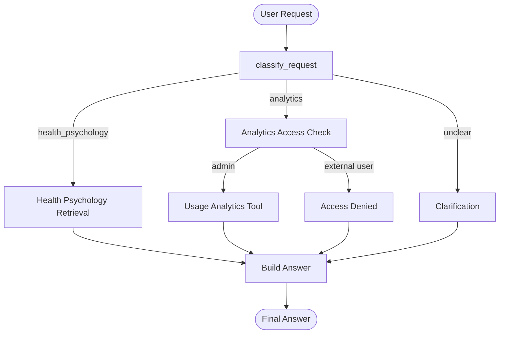

# Homework 8 — Evaluation & Observability

## Health Psychology Domain-Specific Expert Assistant

Homework 8 introduces an evaluation and observability layer for the Health Psychology assistant developed throughout the course.

Before defining evaluation metrics, this homework also documents an architectural decision that emerged from the previous LangGraph implementation:

> evolve from keyword-based routing toward RAG-assisted orchestration with specialized workflows and deterministic policy gates.

The purpose of this change is not to make the system more agentic for its own sake. The goal is to make routing more semantic while keeping security, safety, and execution boundaries explicit and controllable.

---

# 1. Where the project is now

The project has evolved incrementally across the course:

```text
HW1  Knowledge Base + Chunking
 ↓
HW2  Semantic Retrieval
 ↓
HW3  Metadata Filtering + Hybrid Retrieval
 ↓
HW4  Agentic RAG Routing
 ↓
HW5  External Analytics Tool + Authorization
 ↓
HW6  Controlled Workflow + Medical Safety + IVR
 ↓
HW7  LangGraph Orchestration
 ↓
HW8  Evaluation + Observability
```

Homework 7 introduced explicit orchestration with LangGraph.

The current workflow routes requests between:

- Health Psychology retrieval;
- product analytics;
- access-denied handling;
- clarification.

It also introduced explicit state and execution traces through fields such as:

```text
user_request
user_role
route
analytics_access
tool_result
final_answer
executed_nodes
```

This made the workflow easier to inspect and created a useful foundation for run-level evaluation.

---

# 2. Current HW7 architecture

The current implemented workflow is:



This architecture already provides two important control mechanisms:

1. intent-based routing;
2. state-based authorization using a trusted user role.

However, the current `classify_request` implementation uses predefined keyword lists.

For example, Health Psychology requests are detected through words such as:

```text
pain
chronic
stress
psychology
health
behavior
behaviour
com-b
```

while analytics requests use keywords such as:

```text
analytics
users
sessions
queries
usage
```

This is sufficient for demonstrating LangGraph orchestration, but it becomes fragile as the domain and number of capabilities grow.

---

# 3. Limitation discovered in HW7

The main architectural limitation is not LangGraph itself.

The limitation is the current routing strategy.

The router currently behaves approximately like:

```text
if analytics keyword:
    analytics
elif health psychology keyword:
    health_psychology
else:
    clarification
```

This creates several problems.

## 3.1 Paraphrases

A valid Health Psychology question may not contain any predefined keyword.

The system can therefore fail even when the user's intent is semantically clear.

## 3.2 Mixed-intent requests

Consider:

> Can stress affect health and also show me usage analytics?

This request contains both Health Psychology and analytics intents.

The current classifier checks analytics keywords first, so the whole request can be routed to analytics and the Health Psychology part can be lost.

## 3.3 Growing number of capabilities

The final assistant may eventually need to distinguish between:

- scientific Health Psychology questions;
- personal symptom or medical-safety questions;
- product analytics;
- unsupported questions;
- ambiguous questions;
- future specialized workflows.

Adding more keyword lists and `if/elif` conditions would make routing increasingly difficult to maintain.

For this reason, keyword routing is treated as the current **baseline**, not the target architecture.

---

# 4. Target architecture direction

Evaluation in Homework 8 is performed against the current HW7 LangGraph baseline.

At the same time, the evaluation results will inform the next architectural evolution of the project.

The target system is designed as a domain-specific assistant platform with three specialized capabilities:

1. Domain-Specific Expert Assistant;
2. Analytics / Text2SQL Assistant;
3. Customer Support / Clinic Booking Assistant.

The target architecture will use:

- RAG-assisted semantic routing;
- specialized workflows;
- separate model profiles for different tasks;
- a model-agnostic LLM provider layer;
- deterministic authorization and medical safety controls;
- external tools for analytics and appointment booking;
- trace-based evaluation and observability.

The complete target architecture is documented separately in:

`docs/ARCHITECTURE.md`

Supporting product documentation will include:

- `docs/USE_CASES.md`
- `docs/TECH_STACK_AND_MODELS.md`
- `docs/ECONOMICS.md`
- `docs/EVALUATION_STRATEGY.md`

---

# 9. Why this matters for Homework 8

This architectural evolution directly affects what should be evaluated.

Evaluating only the final answer would not show whether a failure came from:

```text
wrong capability retrieval
        ↓
wrong route
        ↓
wrong policy decision
        ↓
wrong tool / workflow
        ↓
wrong knowledge retrieval
        ↓
wrong answer synthesis
```

For this reason, Homework 8 follows a:

> **Trace First**

evaluation strategy.

The evaluation should eventually answer several separate questions:

```text
1. Was the correct capability retrieved?

2. Was the correct route selected?

3. Was the deterministic policy applied correctly?

4. Was the correct workflow or tool executed?

5. If Knowledge RAG was used, was relevant evidence retrieved?

6. Was the final answer grounded in that evidence?

7. How long did the complete run take?

8. Where did failures occur?
```

These should not be collapsed into a single quality score.

---

# 10. Current vs future evaluation scope

The current HW7 implementation is used as the baseline system for Homework 8.

At this stage, the following properties can already be evaluated deterministically:

```text
routing correctness
trace correctness
authorization correctness
tool execution correctness
clarification behavior
latency
runtime errors
```

The Health Psychology retrieval and analytics implementations used in HW7 are intentionally mocked.

Therefore this homework does not pretend to measure production-level RAG groundedness from those mocked results.

Once the real retrieval layer and RAG-assisted router are connected, evaluation can be extended with:

```text
capability retrieval accuracy
routing accuracy
Knowledge RAG Recall@K
retrieval relevance
groundedness
citation correctness
no-answer accuracy
```

---

# 11. Design principle

The architecture and evaluation strategy follow the same principle:

> Use semantic reasoning where semantic reasoning is useful, and deterministic controls where deterministic controls are possible.

For evaluation this means:

```text
deterministic checks first
        ↓
semantic evaluation where necessary
        ↓
LLM-as-a-judge only where deterministic checks are insufficient
```

For orchestration this means:

```text
RAG-assisted semantic routing
        ↓
explicit workflow
        ↓
deterministic safety / authorization
        ↓
specialized execution
```

The goal is not maximum agent autonomy.

The goal is a domain-specific expert assistant whose decisions can be inspected, evaluated, and controlled.
