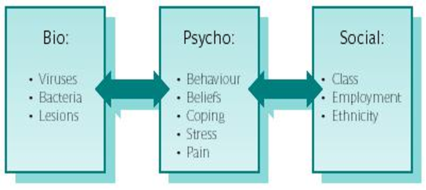
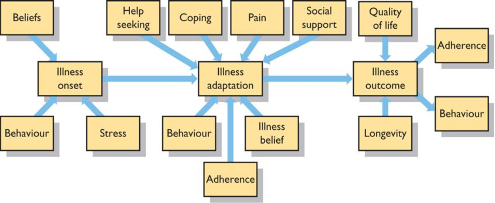
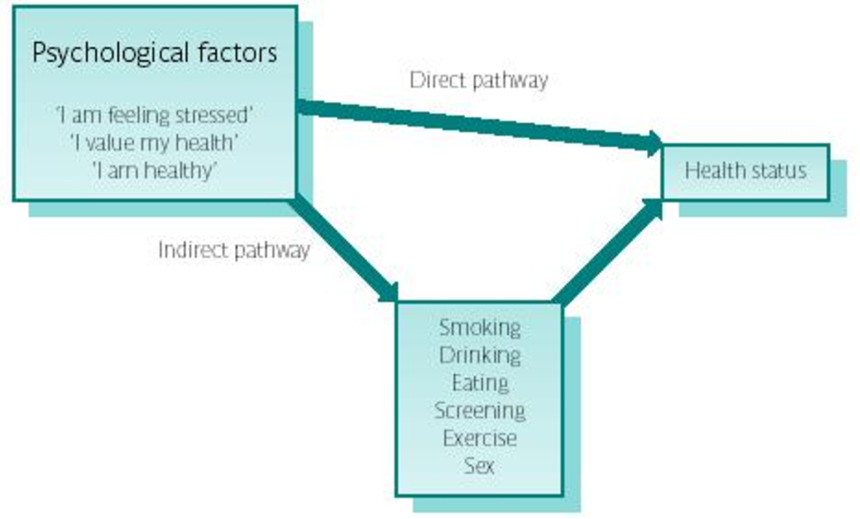
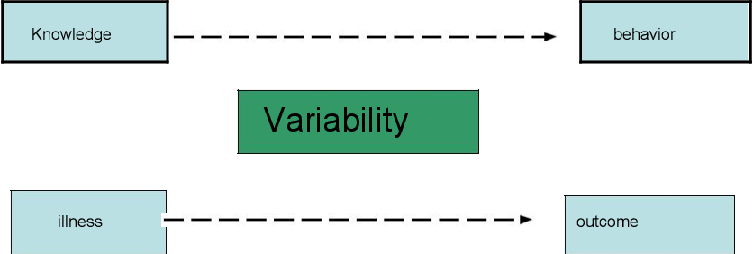
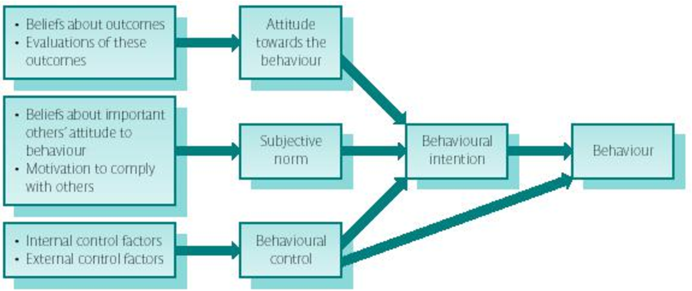
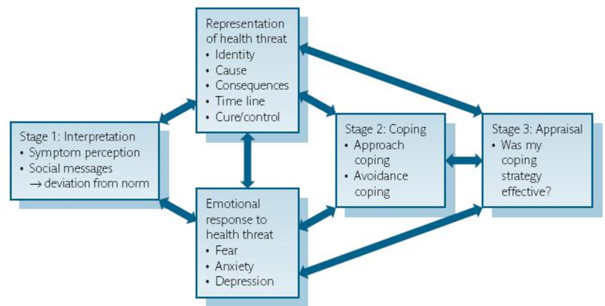
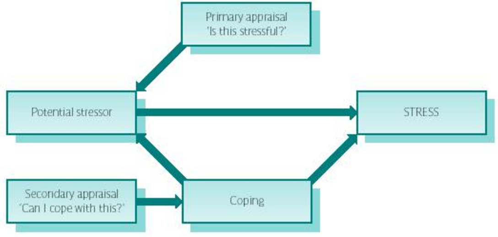

# The Psychology of Health and Illness: An Open Access Course

### Overview

For centuries health professionals have recognized that there are psychological consequences of being ill. A diagnosis of cancer or diabetes can make people anxious or depressed. This course will draw upon health psychology, public health, and community psychology to emphasize how psychology can also contribute to the cause, progression, experience, and outcomes of any physical illness. This course will highlight the many roles that psychology plays in physical illness from i) being and staying well and the role of health behaviors and behavior change; ii) becoming ill with a focus on illness beliefs, symptom perception, help-seeking and communication with health professionals; iii) being ill in terms of stress, pain, and chronic illnesses such as obesity, coronary heart disease, and cancer; iv) the role of gender in health, and v) health outcomes in terms of Quality of Life and longevity.

### Learning objectives and outcomes

By the end of this course students will be able to: 1. Describe the key theoretical frameworks which underpin a psychological approach to physical health 2. Understand the role of health behaviors in explaining health 3. Describe the psychological factors involved in the onset, maintenance, and change of health behaviors 4. Describe the role of illness beliefs and symptom perception in help-seeking and consultation 5. Describe the psychological factors involved in the stress/illness link and the perception and treatment of pain 6. Describe the ways in which health behaviors, illness beliefs, symptom perception, stress, and pain are key to chronic illnesses 7. Describe how health varies by gender 8. Understand the importance of psychological health outcomes including Quality of Life and health status

### About the author

Jane Ogden is a Professor in Health Psychology at the University of Surrey in the UK where she teaches psychology, dietician, nutrition, medical and vet students to think more psychologically about health and illness. Jane’s research interests focus on eating behavior and obesity management, communication, and women’s health. She is the author of over 180 academic papers and 7 books including “Health Psychology: A Textbook” (published by McGraw Hill), “The Psychology of Eating” (published by Blackwell), and “The Psychology of Dieting” (published by Routledge). She is also a regular contributor to the media and has been involved in many TV and radio programs and articles for a range of magazines and newspapers.

Contents 1. Introduction to the Key Theoretical Frameworks of Psychology and Health 2. The Role of Behavior in Health 3. Behavior Change 4. Becoming Ill and the Role of Illness Beliefs, Help-Seeking, and Communication 5. Being Ill and the Experiences of Stress and Pain 6. The Role of Psychology in Chronic Illnesses such as Obesity, CHD, and Cancer 7. Gender and Health 8. Health Outcomes and Quality of Life (QoL)

## Unit 1: An Introduction to the Key Theoretical Frameworks of Psychology and Health

### Overview

Health psychology is the study of physical illness and addresses problems such as obesity, diabetes, cancer, and coronary heart disease (CHD) with a focus on health behaviors (eg. diet, exercise, sleep, help-seeking, medication adherence), illness beliefs, behavior change, and health outcomes. This first unit will describe the background to health psychology and how it compares to a more traditional biomedical model. It will explore the 4 key theoretical frameworks used in health psychology: the biopsychosocial model, health and illness as a continuum, the direct and indirect pathways between health and illness, and the focus on variability.

### The Background of Health Psychology

Health psychology is the study of the role of psychology in any physical health problem including coughs and colds, cancer, coronary heart disease, HIV, obesity, and diabetes. It is best understood by comparing it to the more traditional biomedical model using 5 simple questions as follows:

### The Biomedical Model

The biomedical model can be understood in terms of its answers to the following 5 questions:

- What causes illness? According to the biomedical model, diseases either come from outside the body, invading the body and causing physical changes within the body, or originate as internal physical changes. Such diseases may be caused by several factors such as chemical imbalances, bacteria, viruses, and genetic predisposition.

- Who is responsible for illness? Because illness is seen as arising from biological changes beyond their control, individuals are not seen as responsible for their illness. They are regarded as victims of some external force causing internal changes.

- How should illness be treated? The biomedical model regards treatment in terms of vaccination, medication, chemotherapy, and surgery, all of which aim to change the physical state of the body.

- Who is responsible for treatment? The responsibility for treatment rests with the medical profession.

- What is the role of psychology in health and illness? Within traditional biomedicine, illness may have psychological consequences, but not psychological causes. For example, cancer may cause unhappiness but mood is not seen as related to either the onset or progression of cancer.

### Health Psychology

Over the twentieth century thinking changed and it became obvious that the mind and body were more connected than assumed by the biomedical model. In addition, the greatest risk to health was no longer acute conditions such as TB or flu but chronic illnesses such as coronary heart disease (CHD), cancer, obesity, and diabetes all of which have a clear behavior role. As a result health psychology was developed, which can be understood in terms of the same 5 questions that were asked of the biomedical model:

- What causes illness? Health psychology suggests that human beings should be seen as complex systems and that illness is caused by a multitude of factors and not by a single causal factor. Health psychology, therefore, attempts to move away from a simple linear model of health and claims that illness can be caused by a combination of biological (e.g. a virus), psychological (e.g. behaviors, beliefs) and social (e.g. social support) factors.

- Who is responsible for illness? Because illness is regarded as a result of a combination of factors, the individual is no longer simply seen as a passive victim. For example, the recognition of a role for behavior in the cause of illness means that the individual may be held responsible for their health and illness.

- How should illness be treated? According to health psychology, the whole person should be treated, not just the physical illnesses that have taken place. This can take the form of behavior change, encouraging changes in beliefs and coping strategies, and compliance with medical recommendations.

- Who is responsible for treatment? Because the whole person is treated, as compared to just their physical illnesses, the patient is in part responsible for their treatment. This may take the form of responsibility to take medication and responsibility to change beliefs and behavior. They are not seen as a victim.

- What is the role of psychology in health and illness? Health psychology regards psychological factors not only as possible consequences of illness, but as contributing to it at all stages along the continuum from healthy to ill. Health psychology, therefore, focuses on the role of psychology at all stages of health and illness. In particular, it draws upon the biopsychosocial model of health, health as a continuum, the direct and indirect pathways between psychology and health, and a focus on variability. These 4 key theoretical frameworks will now be considered.

### The Four Key Theoretical Frameworks

### 1.The Biopsychosocial Model

The biopsychosocial model was developed by Engel (1977) and represented an attempt to integrate the psychological (the “psycho”) and the environmental (the “social”) into the traditional biomedical (the “bio”) model of health as follows: (1) the bio contributing factors include genetics, viruses, bacteria and structural defects; (2) the psycho aspects of health and illness were described in terms of cognitions (e.g. expectations of health), emotions (e.g. fear of treatment) and behaviors (e.g. smoking, diet, exercise or alcohol consumption); (3) the social aspects of health were described in terms of social norms of behavior (e.g. the social norm of smoking or not smoking), pressures to change behavior (e.g. peer group expectations, parental pressure), social values on health (e.g. whether health was regarded as a good or a bad thing), social class, the environment, and ethnicity.

#### Fig 1 The biopsychosocial model of health and illness (after Engel 1977, 1980)

Figure description: The biopsychosocial model explains health and illness through the interaction of biological, psychological, and social factors.

### 2. Health and Illness as a Continuum

Health Psychology emphasizes health and illness as being on a continuum and explores the ways in which psychological factors impact health at all stages. Therefore psychology is involved in illness onset (e.g. beliefs, behaviors (smoking, diet), stress), help-seeking (e.g. symptom perception, illness cognitions, Dr./patient communication), illness adaptation (e.g. coping, behavior change, social support, pain perception), illness progression (e.g. stress, behavior change) and health outcomes (e.g. Quality of Life, longevity). This perspective is illustrated in Figure 2.

#### Fig 2: Health and Illness as a Continuum

Figure description: Health and illness are presented as a continuum. Psychological factors influence illness onset, help-seeking, adaptation, illness progression, and health outcomes.

### 3. The Direct and Indirect Pathways between Psychology and Health

Health psychologists consider both a direct and indirect pathway between psychology and health. The direct pathway is reflected in the physiological literature and from this perspective, the way a person experiences their life (“I am feeling stressed”) has a direct impact upon their body through changes in their physiology which can change their health status. The indirect pathway is reflected more in the behavioral literature and from this perspective, the ways a person thinks (“I am feeling stressed”) influences their behavior (“I will have a cigarette”) which in turn can impact upon their health. The direct and indirect pathways are illustrated in Figure 3.

#### Fig. 3 The Direct and Indirect Pathways between Psychology and Health

Figure description: The direct pathway shows psychological states influencing health through physiological changes. The indirect pathway shows psychological states influencing behavior, which then affects health.

### 3. A Focus on Variability

Biomedicine tends to focus on knowledge as a predictor of behavior (“I know smoking kills”) and disease as a predictor of health outcomes (“I have cancer and therefore will die”). Health psychology, however, argues that there is much more variability between people than this and this variability is our focus. For example, two people might both know that smoking is bad for them but only one stops smoking. Similarly, two people might find a lump in their breast but only one goes to the doctor. Further, two people might both have a heart attack but whilst one has another in 6 months time, the other is perfectly healthy and back to work within a month. This variability indicates that health and illness cannot only be explained by illness severity (type of cancer, severity of heart attack) or knowledge (smoking is harmful) but that other factors must have a key role to play. For a health psychologist, these factors include a wide range of psychological variables such as cognitions, emotions, expectations, learning, peer pressure, social norms, coping, and social support. These constructs are the nuts and bolts of psychology and are covered in the units in this book. The notion of variability is shown in Figure 4.

#### Fig 4: The focus on variability

Figure description: The model highlights variability between people in knowledge, behavior, illness progression, and health outcomes.

Knowledge behavior Variability illness outcome The 4 key theoretical frameworks form the basis of health psychology and reflect the emphasis on psychology as having a role at all stages of being healthy and becoming ill. These frameworks can be illustrated by the case example of Mr. A. Mr. A: The example of lung cancer Mr. A grew up in a poor area of India. Both of his parents smoked because it helped them relax after a difficult day. Mr. A was given his first cigarette by his friend when he was 12 and they had great fun learning to smoke without coughing too much. If they were lucky, they found half-smoked cigarettes lying around that they could smoke, but as they grew older his parents would give him one of theirs. Sitting with his dad having a cigarette was a chance to chat with him. Smoking then became a habit and a regular part of his daily life. When he was about 45, he noticed that he had developed a cough which he attributed to the change in the weather and just getting older. The cough continued, but given that his parents both still smoked and were fine, he didn’t worry too much or think that it could be related to smoking. After a couple of years, the cough was much worse and he started to feel a pain in his chest. He went to the doctor who sent him for a chest x-ray. He was busy with work and missed 3 different appointments. Eventually, when he managed to get to the hospital the results indicated that he had lung cancer. He was advised to stop smoking, but didn’t because stopping was hard and everyone around him still smoked. Eventually, he had to give up work when his breathing became difficult, which made him lonely and sad. Mr. A died at the age of 55. This case illustrates many psychological constructs including health beliefs, peer pressure, reinforcement, benefits of a behavior, social norms, habit, illness beliefs, risk perception, help-seeking, delayed help-seeking, doctor decision making, adherence, Quality of Life, and health outcomes. In line with this, the study of the psychology of health and illness has the following aims.

- To assess the role of behavior in the development of illness

- To predict unhealthy behaviors

- To change unhealthy behaviors

- To understand the experience of illness

- To improve the experience of illness

- To understand the predictors of illness outcomes

- To improve illness outcomes

### To Conclude

The psychology of health and illness explores how a number of psychological factors impact on health and illness and emphasizes four perspectives: a biopsychosocial perspective, health and illness as being on a continuum, the direct and indirect pathways between psychology and health, and the focus on variability. This course covers many of the key areas in health psychology and should be of relevance to anyone interested in a broader approach to health and illness. Questions 1. Does health psychology challenge the assumptions of the biomedical model of health and illness? 2. Why do health psychologists consider health and illness to be on a continuum? 3. Is the biopsychosocial model a useful perspective? 4. What problems are there with dividing up the pathways into indirect and direct pathways? 5. What factors could explain variability between people in terms of their behavior and health outcomes? 6. To what extent does health psychology enable the whole person to be studied?

## Unit 2: The Role of Behavior in Health

### Overview

This unit will explore the key role for behavior in health and how behavior can be understood in terms of individual beliefs and a range of psychological models. It will then focus on eating behavior to illustrate how psychological theories can be used to describe and explain why we eat what we eat.

### A Key Role for Behavior

About 50% of mortality from the 10 leading causes of death results from individual behavior indicating that behavior and lifestyle have a potentially major effect on longevity. In particular, Doll and Peto (1981) estimated the contribution of different factors as a cause of all cancer deaths and concluded that tobacco consumption accounts for 30% of all cancer deaths, alcohol for 3%, diet for 35%, and reproductive and sexual behavior for 7%. From this estimate, approximately 75% of all deaths from cancer can be attributed to behavior. It has been calculated that 90% of all lung cancer mortality is attributable to cigarette smoking, which is also linked to other illnesses such as cancer of the bladder, pancreas, mouth, larynx, esophagus, and coronary heart disease. The relationship between mortality and behavior is also illustrated by bowel cancer, which accounts for 11% of all cancer deaths in men and 14% in women. Research suggests that bowel cancer is linked to behaviors such as a diet high in total fat, high in meat, and low in fiber. Behavior, however, is not only linked to illness onset but also to the management of illness and health outcomes. For example, behavior change can aid recovery from a heart attack or stroke, reduce obesity, switch off diabetes, and help a person manage their cancer.

Therefore, health behaviors, in terms of smoking, drinking alcohol, diet, sleep, and exercise are important predictors of health and illness. Health psychologists have therefore attempted to understand and predict health-related behaviors by studying health beliefs. For example, the belief that smoking is dangerous should be associated with non-smoking or smoking cessation; the belief that cervical cancer is preventable should be associated with attendance for cervical screening; the belief that exercise is beneficial should be associated with increased physical activity. Health psychologists study what people believe and whether this relates to how they behave. They also study whether beliefs and behavior can be changed. This unit will address what health behaviors are, the beliefs people hold about behavior, and how these beliefs have been used to develop models of behavior. It will then focus on eating behavior to illustrate the role of psychological factors in predicting what we eat.

### What are Health Behaviors?

Health behaviors are regarded as any behavior that is related to the health status of the individual. These can be behaviors that have a negative impact on health such as smoking, eating foods high in fat, drinking large amounts of alcohol, having a sedentary lifestyle, having unsafe sex, and those behaviors that may have a positive effect such as tooth brushing, wearing seat belts, seeking health information, having regular check-ups, taking medication, sleeping an adequate number of hours per night, having a healthy diet, and being active.

### Individual Beliefs about Behavior

People hold many different types of beliefs which influence their behavior. Here are some of the key ones.

i) Attitudes We hold attitudes about many aspects of life. For example, we may have an attitude that exercise is boring, that smoking is relaxing, that eating vegetables is healthy, that using a condom takes the fun out of sex, that going to the doctor is embarrassing and that alcohol is good for stress. These attitudes will clearly change and shape how we behave. ii) Beliefs about Control Attribution theory states that people want to understand what causes events because this makes the world seem more predictable and controllable. People, therefore, develop beliefs about control and may see aspects of the world and their own behavior as either controllable or uncontrollable. For example, a person who is obese may see this as uncontrollable and attribute their body weight to factors such as “genetics”, “hormones” or “diabetes” which they may feel are beyond their control. In contrast, someone who has had a heart attack may attribute this to their unhealthy lifestyle and feel that there is something that they can do about this. This has led researchers to focus on the notion of health locus of control with people showing either an internal or external locus of control. Such beliefs will influence behavior. iii) Risk Perception People hold beliefs about their own susceptibility to a given problem and make judgments concerning the extent to which they are “at risk”. Smokers, for example, may continue to smoke because although they understand that smoking is unhealthy, they do not consider themselves to be at risk of lung cancer. Likewise, a woman may not get a cervical test because she believes that cervical cancer only happens to women who are not like her.

People have ways of assessing their susceptibility to particular conditions, and this is not always a rational process. It has been suggested that individuals consistently estimate their risk of getting a health problem as less than that of others which has been called unrealistic optimism. In addition, people also show risk compensation and can believe that “I have eaten well today and so, therefore, can have a cigarette” as one healthy behavior is seen to compensate for one unhealthy behavior. iv) Beliefs about Confidence Individuals also hold beliefs about their ability to carry out certain behaviors. Bandura (1977) has termed this self-efficacy to reflect the extent to which people feel confident that they can do whatever it is that they wish to do. A smoker, for example, may feel that she should stop smoking but has very little confidence that she will be able to do so. Likewise, an overweight man may be convinced that he should do more exercise but think that this goal is unlikely to be achieved. These two examples would be said to have low self-efficacy. In contrast, a woman who was motivated to get a health check, and felt confident that she could, would be said to have high self-efficacy. Self-efficacy is a very powerful predictor of behavior.

### Models of Behavior

Researchers have pulled together different beliefs to develop models of health beliefs and their impact on health behaviors as a means to frame research and interventions. Here are some of the key models.

### 1.The Stages of Change Model

The Stages of Change model was developed by Prochaska and DiClemente (1982) to describe the processes involved in eliciting and maintaining change. It is based upon the following stages: 1 Pre-contemplation: not intending to make any changes 2 Contemplation: considering a change 3 Preparation: making small changes 4 Action: actively engaging in a new behavior 5 Maintenance: sustaining the change over time These stages, however, do not always occur in a linear fashion (simply moving from 1 to 5) but the theory describes behavior change as dynamic and not “all or nothing”. For example, an individual may move to the preparation stage and then back to the contemplation stage several times before progressing to the action stage. Furthermore, even when an individual has reached the maintenance stage, they may slip back to the contemplation stage over time. The model also examines how the individual weighs the costs and benefits of a particular behavior which is referred to as decisional balance. In particular, its authors argue that individuals at different stages of change will differentially focus on either the costs of a behavior (e.g. “stopping smoking will make me anxious”) or the benefits of the behavior (e.g. “stopping smoking will improve my health”). For example, a smoker at the action stage (“I have stopped smoking”) and the maintenance stage (“for four months”) tend to focus on the favorable and positive feature of their behavior (“I feel healthier because I have stopped smoking”), whereas smokers in the pre-contemplation stage tend to focus on the negative features of the behavior (“stopping smoking will make me anxious"). The Stages of Change Model has been applied to several health-related behaviors, such as smoking, alcohol use, exercise, and health screening behavior. It is also increasingly used as a basis to develop interventions that are tailored to the particular stage of the specific person concerned.

For example, a smoker who has been identified as being at the preparation stage would receive a different intervention from one who was at the contemplation stage. There have been many criticisms of the Stages of Change Model, but it is a simple and useful approach to describing behavior and frame ways in which to change this behavior.

### 2.The Health Belief Model

The Health Belief Model (HBM) (see Figure 1) was developed initially by Rosenstock (1966) and further by Becker and colleagues throughout the 1970s and 1980s. Over recent years, the Health Belief Model has been used to predict a wide variety of health-related behaviors.

#### Figure 1 Basics of the Health Belief Model

Figure description: The Health Belief Model links perceived susceptibility, severity, benefits, costs, cues to action, health motivation, and perceived control to health behavior.

The HBM predicts that behavior is a result of a set of core beliefs, which have been redefined over the years. The current core beliefs are the individual’s perception of:

- susceptibility to illness (e.g. “my chances of getting lung cancer are high”)

- the severity of the illness (e.g. “lung cancer is a serious illness”)

- the costs involved in carrying out the behavior (e.g. “stopping smoking will make me irritable”)

- the benefits involved in carrying out the behavior (e.g. “stopping smoking will save me money” or “smoking is cool”)

- cues to action, which may be internal (e.g. the symptom of breathlessness), or external (e.g. information in the form of health education)

- perceived control (e.g. “I am confident that I can stop smoking”)

- health motivation (e.g. “I am concerned that smoking might damage my health”) The HBM suggests that these core beliefs should be used to predict the likelihood that a behavior will occur. For example, if applied to a health-related behavior such as screening for cervical cancer, the HBM predicts regular screening for cervical cancer if an individual perceives that she is highly susceptible to cancer of the cervix, that cervical cancer is a severe health threat, that the benefits of regular screening are high, and that the costs of such action are comparatively low. This will also be true if she is subjected to cues to action that are external, such as a brochure in the doctor’s waiting room, or internal, such as a symptom perceived to be related to cervical cancer (whether correct or not), such as pain or bleeding. Further, the model would also predict that a woman would get a screening if she is confident that she can do so and if she is motivated to maintain her health. Much research has been carried out using the HBM indicating that the different components can predict a range of behaviors including dietary compliance, safe sex, having vaccinations, making regular dental visits, taking part in regular exercise programs and health screening behavior. There are several criticisms of the HBM, however, including its focus on the conscious processing of information (for example, is tooth-brushing really determined by weighing up the pros and cons?); its emphasis on the individual (for example, what role does the social and economic environment play?); the absence of the role for past behavior and habit; and the absence of a role for emotional factors such as fear and denial. But the HBM has been a useful approach for carrying out research and designing interventions.

### 3. The Protection Motivation Theory

Rogers (1975, 1985) developed the Protection Motivation Theory (PMT) (see Figure 2), which expanded the HBM to include additional factors, particularly fear as an attempt to include an emotional component into the understanding of health behaviors.

#### Figure 2 Basics of the Protection Motivation Theory

Figure description: Protection Motivation Theory proposes that severity, susceptibility, fear, response effectiveness, and self-efficacy influence behavioral intentions and health behavior.

The PMT describes health behaviors as a product of five components: 1 Severity (e.g. “Bowel cancer is a serious illness”).

2 Susceptibility (e.g. “My chances of getting bowel cancer are high”). 3 Response effectiveness (e.g. “Changing my diet would improve my health”). 4 Self-efficacy (e.g. “I am confident that I can change my diet”). 5. Fear (e.g. an emotional response “I am scared of getting cancer”) These components predict behavioral intentions (e.g. “I intend to change my behavior”), which are related to behavior. If applied to dietary change, the PMT would make the following predictions: information about the role of a high-fat diet in coronary heart disease would increase fear, increase the individual’s perception of how serious coronary heart disease is (perceived severity), and increase their belief that they were likely to have a heart attack (perceived susceptibility). If the individual also felt confident that they could change their diet (self-efficacy) and that this change would have beneficial consequences (response effectiveness), they would report high intentions to change their behavior (behavioral intentions). Much research has used the PMT to predict a range of health behaviors including exercise, breast self-examination, wearing an eye patch, binge drinking, and physical activity. The PMT has been less widely criticized than the HBM; however, many of the criticisms of the HBM also relate to the PMT. For example, the PMT assumes that individuals are conscious information processors; it does not account for habitual behaviors, nor does it include a role for social and environmental factors.

### 4. The Theory of Planned Behavior

The Theory of Reasoned Action (TRA) was extensively used to examine predictors of behaviors and was central to the debate within social psychology concerning the relationship between attitudes and behavior (Fishbein and Ajzen 1975). The Theory of Planned Behavior (TPB) (see Figure 3) was developed by Ajzen and colleagues (Ajzen and Madden 1986) and represented a progression from the TRA.

#### Figure 3 Basics of the Theory of Planned Behavior

Figure description: The Theory of Planned Behavior proposes that attitudes, subjective norms, and perceived behavioral control influence behavioral intentions. Intentions and perceived behavioral control influence behavior.

The TPB emphasizes behavioral intentions as the outcome of a combination of several beliefs. The theory proposes that intentions should be conceptualized as “plans of action in pursuit of behavioral goals” (Ajzen and Madden 1986) and are a result of the following beliefs:

- Attitude towards a behavior, which is composed of either a positive or negative evaluation of a particular behavior and beliefs about the outcome of the behavior (e.g. “exercising is fun and will improve my health”).

- Subjective norm, which is composed of the perception of social norms and pressures to perform a behavior and an evaluation of whether the individual is motivated to comply with this pressure (e.g. “people who are important to me will approve if I lose weight and I want their approval”).

- Perceived behavioral control, which is composed of a belief that the individual can carry out a particular behavior based upon a consideration of internal control factors (e.g. skills, abilities, information) and external control factors (e.g. obstacles, opportunities), both of which relate to past behavior. According to the TPB, these three factors predict behavioral intentions, which are then linked to behavior. The TPB also states that perceived behavioral control can have a direct effect on behavior without the mediating effect of behavioral intentions. If applied to alcohol consumption, the TPB would make the following predictions: if an individual believed that reducing their alcohol intake would make their life more productive and be beneficial to their health (attitude to the behavior) and believed that the important people in their life wanted them to cut down (subjective norm), and in addition believed that they were capable of drinking less alcohol due to their past behavior and evaluation of internal and external control factors (high behavioral control), then this would predict high intentions to reduce alcohol intake (behavioral intentions). The model also predicts that perceived behavioral control can predict behavior without the influence of intentions. For example, if perceived behavioral control reflects actual control, a belief that the individual would not be able to exercise because they are physically incapable of exercising would be a better predictor of their exercising behavior than their high intentions to exercise.

The TPB has been used extensively to predict a wide range of behaviors including condom use in both gay and heterosexual populations, blood donation for blood transfusion and organ donation, smoking, exercise during pregnancy, walking, speeding behavior using a driving simulator, deliberate self-harm, and suicidality. In contrast to the HBM and the PMT, this model attempts to address the problem of social and environmental factors (in the form of normative beliefs). It also includes a role for past behavior within the measure of perceived behavioral control. However, the TPB has also been subjected to criticisms in terms of its constructs, the methods used to test the TPB and the extent to which it can predict behavior.

### In Summary

Behavior is central to health and illness and is clearly linked to the beliefs we hold. Psychology has identified a number of beliefs to predict behavior and then pulled these together into models which can be used for research and to design behavior change interventions. Eating behavior is a key behavior. We will now look specifically at eating behavior in order to illustrate the ways in which psychological theory can help explain why we behave in the way that we do.

### The Example of Eating Behavior

Eating behavior is a health behavior which is clearly linked to health and illness. For example, poor diet is associated with a range of health conditions including obesity, diabetes, coronary heart disease (CHD), cancer, joint problems, hypertension, and stroke. Eating behavior has been studied using three key theoretical approaches which can also be applied to all other health behaviors. These are as follows:

### 1. Cognition Models

A cognitive approach to eating behavior focuses on an individual’s cognitions and has explored the extent to which cognitions predict and explain behavior. Most research has drawn upon social cognition models particularly the HBM and the TPB as described above. Some research using a cognitive approach to eating behavior has focused on predicting the intentions to consume specific foods such as the intentions to eat whole grains, skimmed milk, organic vegetables, and whole grain bread. Much research suggests that behavioral intentions are not particularly good predictors of behavior. Studies have also used the TPB to explore the cognitive predictors of actual behavior and have explored behaviors such as table salt use, healthy eating, low-fat milk consumption, and the intake of fruit and vegetables. The belief which seems to be most predictive of diet is perceived behavioral control indicating that the more control someone feels that they have over eating well, the more likely it is that they are able to actually eat well.

### 2. The Developmental Model

Eating behavior is therefore related to beliefs people hold. These beliefs are learned from a range of sources including parents, peers, siblings, friends, and the media. This process of learning can be understood using the developmental model of eating behavior with its emphasis on exposure, social learning, and associative learning (Birch, 1999). Exposure: The role of exposure simply describes the impact of familiarity on food preferences. Human beings need to consume a variety of foods to have a balanced diet and yet they commonly show fear and avoidance of new foods (called neophobia). Young children will, therefore, show neophobic responses to a new food but must come to accept and eat foods which may originally appear to be threatening. In line with this, studies show that simply repeatedly exposing children to foods can change children’s preferences and have indicated that between 8-10 times is optimal. Social Learning: Social learning or modeling reflects the impact of watching other people’s behavior on our own behavior and is derived from social learning theory. In terms of eating, research indicates that food preferences can be learned from role models, peers, parents, and the media. For example, research on peer modeling indicates that after one week children will change their vegetable preference according to the preferences of the child they sit with and that when children leave home, parents own behavior is the best predictor of a child’s eating behavior after one year of independence. Associative Learning: There is also a wealth of research showing that both conditioning and reinforcement influence food preferences in children. For example, rewarding food choice with praise in the form of parental approval seems to improve food preferences. Further, using food to reward behavior as in “if you are well behaved you can have a cookie” not only has positive effects on a child’s behavior in the short term but also makes the reward food more attractive which can encourage unhealthy food preferences if the reward food is an unhealthy food. In addition, using food to encourage the intake of other foods as in “if you eat your vegetables you can have pudding” can also change food preferences and this practice has been shown to increase the preference for the reward food (pudding), but in turn decrease preference for the access food (vegetables).

### 3. A Weight Concern Model of Eating Behavior

Food is associated with many meanings such as a treat, a celebration, a family get-together, being a good mother, and being a good child. Furthermore, once eaten, food can change the body’s weight and shape, which is also associated with meanings such as attractiveness, control, and success. As a result of these meanings many women, in particular, show weight concern in the form of body dissatisfaction, which often results in dieting. The impact of dieting, which has been termed “restrained eating” on eating behavior will now be described. Dieting aims to reduce food intake and several studies have found that at times this aim is successful. But several studies have also shown that higher levels of dieting are related to increased food intake. In particular, by trying to eat less, dieters can become more preoccupied with food, meaning than when they break their diet they then overeat. For example, if a person spends all day thinking “I won’t eat cookies” they become preoccupied with cookies so that when they give in and have one they then end up eating the whole package. This is called disinhibition or the “what the hell effect” and can occur as a response to denial, mood changes, alcohol, smoking cessation, or simply eating something that was being avoided. In summary, diet relates to health both in terms of illness onset, prevention, and treatment, however, many people do not always eat in accordance with current dietary recommendations. Psychological research has focused on three main theoretical perspectives to explain eating behavior. A developmental approach emphasizes exposure and social and associative learning, a cognitive model emphasizes an individual’s cognitions, and a weight concern model draws upon the literature relating to dieting and the causes of overeating. These theories can also be applied to all other forms of health behavior.

### To Conclude

Behavior is central to health and illness and can be predicted by people’s beliefs using individual beliefs or models. Eating behavior is central to many health issues and illustrates how psychology can be used to understand why people behave in the way that they do. Questions 1. Why is it important to explain and predict health related behaviors? 2. To what extent do individual beliefs predict behavior? What other factors might be involved? 3. To what extent do models of beliefs and behavior help to explain actual behavior? 4. Why do you think we eat what we eat?

## Unit 3: Behavior Change

### Overview

It is clear that health behaviors such as diet, smoking, exercise, sleep, help-seeking, and medication adherence relate to health and illness. The previous unit described these behaviors and how they are linked to beliefs. This unit will describe some of the ways in which behavior can be changed drawing upon four main theoretical perspectives: i) learning theory (with added cognitions); ii) social cognition theory and the use of planning; iii) the stages of change model and the development of motivational interviewing; and iv) using emotion.

### Four Main Theories Informing Behavior Change

### 1. Learning Theory (with added cognitions)

Any behavior whether it be speaking, walking, or eating is learned through the three key mechanisms of modeling (watching others), reinforcement (any source of reward), and association (being linked with internal factors such as mood or external factors in our environment). Changing behavior, therefore, involves unlearning the old behavior and learning the new behavior using these same mechanisms in the following ways: Modeling: We can change our behavior by watching those around us and focusing on the behaviors we want to copy. This could be the behavior of our family, friends, health care professionals, teachers, work colleagues or even people we see from a distance in the media. Therefore, if you want to change your behavior it is helpful to surround yourself with people who behave in the desired way, to make yourself focus on those who behavior more healthily and to try to ignore those that do not. This is known as modeling, observational learning, or social learning. Reinforcement: A behavior is always more likely to reoccur if it is reinforced or rewarded in some way. This can be through someone else smiling, giving praise, or showing pleasure, through self-reward in the form of stickers on a sticker chart, treats, gaining or saving money, or self-praise. But, however it comes, praise will help to make a new behavior happen again. And positive reinforcement is always far more effective than criticism which can often just lower people’s self-esteem or mood rather than change their behavior. Association: Any behavior will become associated with internal factors such as mood or external aspects of the environment. Changing behavior, therefore, involves making new associations so that the newer, healthier behavior, becomes more positive and the older, unhealthier behavior, becomes more negative. This can be achieved by searching for images of disease and placing them next to images of unhealthy foods or cigarettes; finding images of a healthy life and placing them next to images of healthier foods; making yourself associate being sedentary with feelings of tiredness, boredom, and feelings of being lazy; learning to associate eating well with feelings of health and well-being; and pairing the feelings of being outside, fresh air, and doing exercise, with renewed energy. These basic learning strategies can then be added to strategies to change cognitions and how we think. Together, this forms the basis of Cognitive Behavioral Therapy (CBT). Changing Cognitions: Research shows that cognitions can be changed through the use of “Socratic questions” which involve searching for evidence to see whether any given cognition is actually backed up by anything. For example, if someone says “nobody likes me” then you search to find evidence of people who do like them; if they say “I always fail” then you search for evidence to show that sometimes they succeed and if they say “if I can’t be the best then I’m useless”, you find evidence when they were good enough and this was fine. Cognitive Behavior Therapy (CBT) is the combination of behavior change strategies and cognitive restructuring and is used in a multitude of settings and is an effective way to change behavior. An additional approach that can be used to change behavior which draws upon the basics of CBT is called Relapse Prevention which has mostly been used to change addictive behaviors. Relapse Prevention involves a multitude of strategies including relaxation, contract setting, and skills training but the concept which is often useful to behavior change is the Abstinence Violation Effect (AVE). The AVE describes the stage between an initial lapse (i.e. one cookie if you are dieting) and a full-blown relapse (i.e. the whole package) and offers an analysis of how to make a relapse less likely. Specifically, the approach argues that a lapse turns into a relapse if the individual blames themselves and experiences a sense of cognitive dissonance due to the uncomfortable gap between how they see themselves (as someone who is healthy) versus their actual behavior (someone who has just lapsed). It then argues that the best intervention is to encourage people to find something else to blame other than themselves such as the situation (“I was at a party”, “someone offered me a cigarette”, “I had a very difficult day”). That way a person doesn’t experience self-blame, their dissonance is reduced and they can return to their efforts to stop smoking/dieting etc. and avoid the relapse. This process finds parallels in the notion of the “What the hell effect” in the dieting literature and is a useful approach to behavior change.

### 2. Social Cognition Theory and the Use of Planning

In Unit 2 several models of beliefs and behavior were described including the HBM, the PMT, and the TPB. These models are often called social cognition models and describe the ways beliefs predict behavior mostly through behavioral intentions. The problem often is, however, that intentions do not always lead to actual behavior change. For example, a person may intend to go to the gym tomorrow but when the time comes they are distracted by having lunch with a friend. This is known as the intention-behavior gap. One of the simplest ways to help intentions translate into behavior and promote behavior change is to set goals and make plans. These should be clear and specific describing the what, where, and when of any given behavior. In psychology, these are sometimes referred to as “implementation intentions” and refer to plans such as “I will eat fish and rice for lunch at 12.00 tomorrow” rather than “I will eat more healthily”. In the broader health literature, the best goals are said to be SMART which requires them to be Specific, Measurable, Attainable, Relevant, and Timely. Research indicates that goal setting can help change a range of health- related behaviors. It can be even more effective if these goals are shared with others and made public. This can form the basis of a psychological contract between a person and their family, friends, or health care professional which then adds some accountability.

### 3. Stages of Change Model and Motivational Interviewing

Health care professionals often use the Stages of Change Model to describe how ready their clients are to change. This model describes five different stages which are pre-contemplation (not thinking about change), contemplation (thinking about change), preparation (starting to prepare for change), action (making changes), maintenance (keeping the changes), and relapse (going back to the old behavior). Although this model has been criticized in many ways, it is a useful way of describing people at the start of any behavior change intervention and has led to two key developments for behavior change. The first is the notion of a stage- matched intervention which simply states that any intervention should be matched to the person’s readiness to change. Therefore, if someone is still in the pre-contemplation stage, it is probably not worth trying to get them to change yet. Second, the stages of change approach has resulted in the development of Motivational Interviewing (MI), which is very commonly used to change behavior and move people between stages. MI focuses on the notion of cognitive dissonance which is the uncomfortable feeling people get when there is a mismatch between how they see themselves and how they are behaving. For example, if you see yourself as kind, but have just been unkind you will experience a sense of cognitive dissonance. Similarly, if you think “I am a sensible person who takes care of myself” but “I am not taking my medication after my heart attack”, you will likely feel dissonance. Some therapies try to make the dissonance go away using reassurance. MI does the opposite and tries to make the dissonance worse based on the premise that this increased dissonance will push people to change what they do. This is achieved by asking people to describe the costs and benefits of their behavior, and then feeding those back to them so that they can see the gap between one set of beliefs about themselves and what they are actually doing. So, if you are overweight you might think “I like eating a lot because it helps me manage my emotions” AND also at the same time think “my weight is making me miserable”. If these mismatching thoughts are then fed back to you, it is likely you will think “time to change how I eat”. Motivational interviewing can be used by health care professionals to change the behavior of others. But it can also be used to promote self-change particularly if you write down the different costs and benefits, and then make yourself compare and contrast these costs and benefits, exposing the dissonance.

### 4. Using Emotion

For many years, health promotion campaigners believed that fear was the best strategy to change behavior and as a result smoking cessation campaigns included words such as “smoking kills” or “smoking seriously damages your health”. This approach was informed by the notion of a fear appeal whereby campaigns were designed to make people frightened. For weight loss this would involve the following steps: “There is a threat to being overweight”: ‘Heart disease’, ’diabetes’; “You are at risk”: ‘being overweight puts you at risk of heart attack’ and “The threat is serious”: ‘heart attack kills’. This was then followed by a safety condition which explained how people could avoid this threat: “A recommended protective action”: ‘eat less’, ‘do more exercise’; “The action is effective”: ‘eating a healthy diet helps protect against heart attack’ and “The action is easy”: ‘healthy eating is easy and cheap’. Unfortunately, evidence indicates that these fear appeals were not very effective and that either too much or too little fear caused people to ignore this information. In particular, it seems that when frightened, people block the messages, creating a gap between how they see themselves and how they are behaving which challenges their sense of integrity. This blocking is achieved by a number of methods including criticizing the message (“It’s not very clear”, “the brochure is badly designed”), questioning its source (“scientists can’t be trusted”) or the messenger (“you’re overweight, what do you know about weight loss” or “you’re thin what do you know about weight loss”).

There are three possible solutions to the problem of blocking. The first is simply to identify the perfect moderate amount of fear and use that amount. This is difficult, however, because each individual has their own fear response and so judging the level of fear necessary either at a population or even at an individual level would be pretty much impossible. The second approach is to use images rather than just text. Much research indicates that visual imagery is harder to block than text alone because it seems to directly influence our emotions while bypassing our cognitions so that we are unable to intellectually rationalize and dismiss the messages they present. Finally, there is also evidence that negative messages may be more likely to be heard if the person is helped to feel good about themselves beforehand. This can be achieved through either self-affirmation or encouraging gratitude. Self-affirmation is a process by which a person is asked to consider good things about themselves. This could be “think of a time when you have been kind” or “Write down 3 things that you are good at”. Likewise, gratitude interventions encourage people to focus on the good things in their life that they can feel grateful for (e.g. “I have nice parents”; “my job is secure”; “my children are well”). Once self-affirmed or feeling more grateful, people feel better about themselves and therefore feel less threatened by messages telling them to change their behavior. This is similar to the notion of a “feedback sandwich” in education (well done for answering the question, BUT you could have added more evidence), the recommended mode of communication for a medical consultation (the good news is xxx but the bad news is xxx), and the counseling approach to managing conflict in relationships (thanks for doing the washing up, but it would help if you cooked sometimes).

### To Conclude

Behaviors are clearly linked to health and illness in terms of illness prevention, illness onset, and illness management once a person is ill. It is, therefore, key to develop interventions to change behavior. Psychologists have developed a range of behavior change strategies based on 4 theoretical perspectives. These include unlearning behavior and adding cognitive restructuring as a means to practice CBT, making plans to close the intention-behavior gap, using motivational interviewing to move people through the stages of change, and using emotion in a positive way supported by visual images, self-affirmation, or gratitude interventions. Questions 1. Which behavior change strategies can be used to unlearn a health behavior? 2. How can cognitions be changed? 3. Why does planning help to change a behavior? 4. How can feeling dissonance help someone change what they do? 5. Why does fear not always change behavior?

## Unit 4: Becoming Ill and the Role of Illness Cognitions, Help-Seeking, and Communication

### Overview

Unit 2 described health beliefs and the models that have been developed to evaluate these beliefs and their relationship to health behaviors. People, however, also have beliefs about illness and these beliefs relate to how they behave when they are ill, whether or not they seek help and the communication they then have with their health professional. This unit will describe illness beliefs in the context of a model called the Self Regulatory Model (SRM). It will then describe the factors relating to help-seeking behavior which includes symptom perception and illness beliefs and then explore medical consultation and the role of the health professional’s own beliefs in the clinical decision-making process.

### What are Illness Beliefs?

Howard Leventhal and his colleagues (Leventhal et al. 1980, 2007) defined illness beliefs as “a patient’s own implicit common sense beliefs about their illness”. They proposed that these beliefs provide patients with a framework or a schema for coping with and understanding their illness, and telling them what to look out for if they are becoming ill. Using interviews with patients suffering from a variety of health conditions, Leventhal and colleagues identified 5 core beliefs: 1 Identity: This refers to the label given to the illness (the medical diagnosis) and the symptoms experienced (e.g. “I have a cold” – the diagnosis, “with a runny nose” – the symptoms). 2 The perceived cause of the illness: These causes may be biological, such as a virus or a lesion, or psychosocial, such as stress or health-related behavior. In addition, patients may hold representations of illness that reflect a variety of different causal models (e.g. “My cold was caused by a virus”, “My cold was caused by being run down”). 3 Time line: This refers to the patients’ beliefs about how long the illness will last, whether it is acute (short-term) or chronic (long-term) (e.g. “My cold will be over in a few days”). 4 Consequences: This refers to the patient’s perceptions of the possible effects of the illness on their life. Such consequences may be physical (e.g. pain, lack of mobility), emotional (e.g. loss of social contact, loneliness) or a combination of factors (e.g. “My cold will prevent me from playing football, which will prevent me from seeing my friends”). 5 Curability and controllability: Patients also represent illnesses in terms of whether they believe that the illness can be treated and cured and the extent to which the outcome of their illness is controllable either by themselves or by powerful others (e.g. “If I rest, my cold will go away”, “If I get medicine from my doctor my cold will go away”). Leventhal incorporated his description of illness beliefs into his Self-Regulatory Model of Illness Behavior (SRM). This model is based on approaches to problem-solving and suggests that illness/symptoms are dealt with by individuals in the same way as any other problem. It is assumed that, given a problem or a change in the status quo, the individual will be motivated to solve the problem and re-establish their state of normality. Traditional models describe problem-solving in three stages: (1) interpretation (making sense of the problem); (2) coping (dealing with the problem in order to regain the status quo); and

(3) appraisal (assessing how successful the coping stage has been). According to models of problem-solving, these three stages will continue until the coping strategies are deemed to be successful and a state of equilibrium has been attained. In terms of health and illness, if healthiness is an individual’s normal state, then any onset of illness will be interpreted as a problem and the individual will be motivated to re-establish their state of health (i.e. illness is not the normal state). These stages have been applied to health using the Self Regulatory Model of Illness Behavior (see Figure 1).

#### Figure 1 Leventhal’s Self Regulatory Model of Illness Behavior (SRM)

Figure description: Leventhal's Self-Regulatory Model describes illness management as a cycle of interpretation, coping, and appraisal. Illness beliefs and emotional responses influence coping strategies.

The different stages are as follows. Stage 1: Interpretation An individual may be confronted with the problem of a potential illness through two channels: symptom perception (“I have a pain in my chest”) or social messages (“the doctor has diagnosed this pain as angina”). The individual is then motivated to return to a state of “problem-free” normality which involves assigning meaning to the problem which is done by accessing the individual’s illness beliefs in terms of the following dimensions: identity, cause, consequences, time line, and cure/control. These illness beliefs will give the problem meaning and will enable the individual to develop and consider suitable coping strategies. However, an illness belief is not the only consequence of symptom perception and social messages and a person will also show changes in their emotional state. For example, perceiving the symptom of pain and receiving the social message that this pain may be related to coronary heart disease may result in anxiety. Therefore, any coping strategies have to relate to both the illness belief and the emotional state of the individual. Stage 2: Coping The next stage in the self-regulatory model is the development and identification of suitable coping strategies. Coping can take many forms, however, there are two broad categories of coping which incorporate the multitude of other coping strategies: approach coping (e.g. taking pills, going to the doctor, resting, talking to friends about emotions) and avoidance coping (e.g. denial, wishful thinking, drinking too much alcohol). When faced with the problem of illness, the individual will develop coping strategies in an attempt to return to a state of healthy normality. Stage 3: Appraisal The third stage of the Self Regulatory Model is appraisal. This involves individuals evaluating the effectiveness of the coping strategy and determining whether to continue with this strategy or whether to try an alternative one.

Therefore, not only do people have beliefs about their health behaviors such as diet, exercise, and smoking but also about their illnesses. These illness beliefs seem to be made up of 5 core beliefs and are central to how people make sense of their illness. This, in turn, influences the choice of coping strategies and the ultimate outcome of their health condition as illustrated by the SRM. The ways in which people make sense of a range of chronic illnesses will be explored in unit 6. The rest of this unit will explore how illness beliefs influence help-seeking behavior and the communication they have with their health care professional in a consultation. Help-Seeking Behavior Help-seeking behavior refers to the process of deciding to get professional help for a health- related problem. According to a biomedical model help-seeking relates to two factors:

- Symptoms: The patient has a headache, back problem, or change in bowel habits that indicates that something is wrong.

- Signs: On examination, the doctor identifies signs such as raised blood pressure, a lump in the bowel, or hears rattling when listening to a patient’s chest which indicates that there is a problem. From this perspective, the doctor is a detective and the patient is required to bring them the problem. Help-seeking, however, is not as simple as this and many people go to the doctor with very minor symptoms (e.g. “I had a sore throat last week but it’s gone now”, “I’m tired but keep going to bed late”) and many patients don’t go to their doctor when they have something serious (e.g. “I have had this breast lump for about five years and it has now come through the skin”). Help-seeking is, therefore, much more complex than the detection of symptoms and the identification of signs, and can be understood in terms of a number of thresholds that need to be reached. These thresholds are as follows:

- Is it a symptom? “I have a pain in my stomach”.

- Is it normal or abnormal? “I have a pain in my stomach and it’s not just indigestion”

- Do I need help? “I have a pain in my stomach, it’s not just indigestion and it might be cancer”.

- Could a doctor help? “I have a pain in my stomach, it’s not just indigestion and it might be cancer and doctors know about cancer”. These thresholds can be understood in terms of three processes: symptom perception, illness beliefs, and the costs and benefits of going to the doctor. i) Symptom perception The translation of a vague feeling into the concrete entity of a symptom involves the processes of symptom perception. Research indicates that whether or not we perceive ourselves as having a symptom is influenced by four main sources of information: Bodily data: Symptom perception is in part “data-driven” as we receive information from our bodies. Symptom perception, however, is not as simple as receiving bodily data and symptom severity can be exacerbated or modified through mood, cognitions, and the social context. Symptoms can be generated even in the absence of bodily data (e.g. Watching a film of head lice can make people itch).

Mood: Stress and anxiety can make symptoms worse, whereas relaxation can make them feel better. For example, higher depression and anxiety are consistently linked with greater symptom perception for a range of chronic illnesses such as irritable bowel syndrome, fibromyalgia, and chronic fatigue syndrome. Cognitions: Focusing on a symptom makes it worse and distraction makes it better. Therefore, many strategies can help reduce symptoms through distraction including being busy, talking to friends, using stress balls during an operation, listening to music, and staying employed if possible. Social Context: Symptoms also vary according to social context. For example “medical student’s disease” describes how medical students often develop the symptoms of whatever condition they are studying and research also indicates that smiling, yawning, shivering, and itching can be contagious if people watch others experiencing these symptoms. The processes of symptom perception, therefore, help to translate a vague experience into a concrete symptom. Before this leads to help-seeking, however, the individual also has to decide whether the symptom is abnormal and whether it requires formal help from a doctor. This is influenced by the development of illness beliefs. ii) Illness Beliefs Once a symptom has been perceived as such, a person then forms a mental representation of the problem. This has been called their “illness belief” which was described above. Research indicates that illness beliefs often consist of the same 5 dimensions relating to identity (“what is it?”), timeline (“how long will it last?”), causes (“what caused it?”), consequences (“will it have a serious effect on my life?”) and control/cure (“Can I manage it or do I need treatment?”). The formation of these beliefs will be helped by social messages from friends, family, or the media to decide whether or not a symptom is serious, abnormal, or manageable by self-care. It will also be influenced by the individual’s own health history and expectations of their own level of health. For example, a patient who has recurring headaches may be less surprised by a new headache whereas someone who is always well may react more strongly to a less serious symptom. This process of normalization can pose problems for both the patient and the doctor (once in a consultation) as a heavy smoker may not tell the doctor that they are breathless because they always are and have become used to it. Further, if an individual lives in a family where indigestion is normal, then chest pain may be more readily labeled indigestion than “possible heart attack”. Therefore, illness beliefs take the symptom up to the next threshold as it is deemed to be abnormal (or not) and serious (or not). iii) Costs and benefits of Going to the Doctor The final step before a patient seeks help involves weighing the costs and benefits of seeing the doctor. These can be classified as follows: Therapeutic: First the patient needs to weigh the therapeutic costs and benefits of going to the doctor. Possible benefits include gaining access to effective treatments and being referred for specialist advice and treatment. Help-seeking also comes with costs, however, such as being given medicines to take (for someone who doesn’t like taking medicines), taking medicines with side effects, having to go through a potentially embarrassing physical examination, or having to talk about an embarrassing personal problem. Practical: Any visit to the doctor involves practical costs because it involves time off work, time away from the family, the cost of travel and the effort in getting to the doctor’s office.

Emotional: Many people enjoy visiting their doctor for emotional reasons. For example, the trip can give a structure to their day, they might meet people to talk to at the office and the doctor can be reassuring, interested, sympathetic and caring. There may, however, also be negative emotions generated by such a visit, such as embarrassment or a feeling of being a nuisance to a doctor who is perceived as already too busy and overworked. The Sick Role: A doctor has the power to turn a person into a patient by legitimizing their symptoms. Therefore, although they may have been complaining of a sore throat, they will get more sympathy if they can say “my doctor says I have tonsilitis”. This has been called the “sick role” and can come with benefits known as secondary gains (taking time off work, or sympathy) or costs (feeling ill). Help-seeking, therefore, reflects a number of thresholds whereby an initial sensation (“Ouch”) is turned into a symptom which is deemed to be abnormal and serious enough to need professional help and whereby the benefits of seeing the doctor outweigh the costs. This involves symptom perception, illness beliefs, and weighing the costs and benefits of going to the doctor. The Medical Consultation Once a person has decided to seek help, they come into contact with a health professional and this consultation between the patient and health professional is the context within which key decisions about diagnosis and management are made. Traditional models of the consultation regarded doctors as the expert with an objective knowledge set that came from their extensive medical education, which was communicated to a passive patient who absorbed any suggestions and responded accordingly. More recently, the relationship has become more equal with the doctor being seen as having their own beliefs and biases and the patient being seen as knowing pertinent information. This raises issues around how health professionals make decisions and the extent to which this is influenced by their own beliefs. How do Health Professionals Make Decisions? Health professionals are now confronted with patients with illnesses such as cancer, heart disease or Multiple Sclerosis, but patients present with a huge range of vague and often very common symptoms such as headaches, back pain, tiredness, and bowel changes. Their role is to decide what these symptoms mean. This involves differentiating between the pain in the chest that means “indigestion” and the one that means “heart disease” and the raised temperature that means “the flu” and the one that means “meningitis”. Once a problem has been diagnosed they then have to decide on an appropriate management strategy which could range from “do nothing because it will go away”, “prescribe medicine”, “refer as a non- urgent patient for a second opinion”, “refer urgently” or “call the ambulance”. The doctor’s role is, therefore, highly skilled and complex. It is further complicated by the high numbers of people coming through their doors with housing, relationship, and insurance benefits issues. Some patients come every week with a different symptom and some patients are too embarrassed to describe the real reason for their visit, but spend the consultation describing another symptom that is irrelevant. This process of clinical decision-making has been understood within the framework of problem-solving.

A Model of Problem-Solving Clinical decisions can be conceptualized as a form of problem-solving and involve the development of hypotheses early on in the consultation process. These hypotheses are subsequently tested by the doctor’s selection of questions. Models of problem-solving have been applied to clinical decision making to highlight the process of formulating a clinical decision and involves the following stages (see Figure 2).

#### Figure 2 Diagnoses as a Form of Problem-Solving

Figure description: Clinical diagnosis is presented as a problem-solving process involving information gathering, hypothesis development, searching for confirming or disconfirming attributes, and making a management decision.

The stages of decision-making are as follows: 1. Accessing information about the patient’s symptoms. The initial questions in any consultation from a health professional to the patient will enable the health professional to understand the nature of the problem and to form an internal representation of the type of problem. 2. Developing hypotheses. Early on in the problem-solving process, the health professional develops hypotheses about the possible causes and solutions to the problem. 3 Search for attributes. The health professional then proceeds to test the hypotheses by searching for factors either to confirm or to refute their hypotheses. Research into the hypothesis-testing process has indicated that although doctors aim to either confirm or refute their hypothesis by asking balanced questions, most of their questioning is biased towards confirmation of their original hypothesis. Therefore an initial hypothesis that a patient has a psychological problem may cause the doctor to focus on the patient’s psychological state and ignore the patient’s attempt to talk about their physical symptoms. Studies have shown that doctors’ clinical information collected subsequent to the development of a hypothesis may be systematically distorted to support the original hypothesis. Furthermore, the type of hypothesis has been shown to bias the collection and interpretation of any information received during the consultation. This is known as confirmation bias. 4 Making a management decision. The outcome of the clinical decision-making process involves the health professional deciding on the way forward. The outcome of a consultation and a diagnosis, however, is not an absolute entity but is itself a hypothesis and an informed guess that will be either confirmed or refuted by future events. Explaining Variability Not all health professionals make the same decisions, however, and if one patient were to visit different doctors they may end up with a different diagnosis, a different referral, and different treatment plans. This variability in the behavior of health professionals can be understood in terms of the processes involved in clinical decisions. For example, health professionals may:

- access different information about the patient’s symptoms

- develop different hypotheses

- access different attributes either to confirm or to refute their hypotheses

- have differing degrees of bias towards confirmation

- consequently reach different management decisions. One key area that influences health care professionals’ decision making is their health beliefs. The Role of Health Professional’s Health Beliefs Patients have beliefs about their behavior (i.e. their health beliefs) and about their illnesses (i.e. their illness beliefs). Health professionals also have their own beliefs and these influence the clinical decision-making process. In particular, these beliefs can influence the original hypothesis as follows: 1. The health professional’s own beliefs about the nature of clinical problems. If a health professional believes that health and illness are determined by biomedical factors (e.g. lesions, bacteria, viruses) then they will develop a hypothesis about the patient’s problem that reflects this perspective (e.g. a patient who reports feeling tired all the time may be anemic). However, a health professional who views health and illness as relating to psychosocial factors may develop hypotheses reflecting this perspective (e.g. a patient who reports feeling tired may be under stress). 2. The health professional’s estimate of the probability of the hypothesis and disease. Health professionals believe that some conditions are more common than others depending on their experience. For example, some doctors may regard childhood asthma as a common complaint and hypothesize that a child presenting with a cough has asthma, whereas others may believe that childhood asthma is rare and so will not consider this hypothesis. This will change their decision-making. 3. The seriousness and treatability of the disease. Health professionals also have beliefs about how serious and treatable different conditions are. As a result, they consider the “pay-off” between their beliefs about seriousness and treatability. For example, a child presenting with abdominal pain may result in an original hypothesis of appendicitis because this is both a serious and treatable condition, and the benefits of arriving at the correct diagnosis for this condition far outweigh the costs involved (such as time-wasting) if this hypothesis is refuted. 4. Personal knowledge of the patient. The original hypothesis will also relate to the health professional’s existing knowledge of the patient. Such factors may include the patient’s medical history, knowledge about their psychological state, an understanding of the world they live in and a belief about why the patient uses medical services. 5. The health professional’s stereotypes. Most meetings between health professionals and patients are time-limited and consequently, stereotypes play a central role in developing and testing a hypothesis and reaching a management decision. Stereotypes reflect the process of “cognitive economy” and may be developed according to a multitude of factors such as how the patient looks/talks/walks or whether they remind the health professional of previous patients. Without stereotypes, consultations between health professionals and patients would be extremely time-consuming. Other factors that may influence the development of the original hypothesis include mood, the health professional’s own age, sex, weight, geographical location, previous experience and health-related behavior (e.g. diet, exercise).

### To Conclude

People not only have beliefs about their behavior but also about illness. These illness beliefs are key to the process of sense-making and have been studied within the context of the Self Regulatory Model (SRM). Such beliefs influence help-seeking which also relates to symptom perception and weighing the costs and benefits of going to the doctor. Health professionals, however, also have beliefs and these are central to the clinical decision- making process. Questions 1. How do people make sense of their illnesses? 2. What are the stages of the SRM? 3. What factors influence symptom perception? 4. Why do some people not seek help? 5. To what extent are health professional’s decisions influenced by their beliefs?

## Unit 5: Being Ill and the Experience of Stress and Pain

### Overview

Unit 4 described the ways in which people make sense of their health and illness through their illness beliefs and how this relates to help-seeking behavior and medical consultation. From this perspective, illness is experienced by each person differently and this experience influences the outcome of any illness. Two areas that clearly illustrate the importance of the patient experience are stress and pain. This unit will first explore why some events are perceived as more stressful than others and the impact of stress on health and illness. It will then describe how pain is best considered a perception, rather than a sensation, and as such can be modified by a range of psychological factors. Stress There is a vast literature on stress. This unit will explore what stress is, the appraisal model of stress, and the ways in which stress impacts health and illness. What is Stress? The term “stress” means many things to many different people. A layperson may define stress in terms of pressure, tension, unpleasant external forces, or an emotional response. Contemporary definitions of stress regard external environmental stress as a stressor (e.g. problems at work), the response to the stressor as stress or distress (e.g. the feeling of tension), and the concept of stress as something that involves biochemical, physiological, behavioral, and psychological changes. Researchers have also differentiated between stress that is harmful and damaging (distress), and stress that is positive and beneficial (eustress). In addition, researchers differentiate between acute stress, such as an exam or public speaking, and chronic stress such as job stress and poverty.

The most commonly used definition of stress was developed by Lazarus and Launier (1978), who regarded stress as a transaction between people and the environment and described stress in terms of “person-environment fit”. If a person is faced with a potentially difficult stressor such as an exam or public speaking, the degree of stress they experience is determined first by their appraisal of the event (“is it stressful?”) and second by their appraisal of their own personal resources (“will I cope?”). A good person-environment fit results in no or low stress and a poor fit results in higher stress. This is described within the transactional model of stress and the key role for appraisal. The Transactional Model of Stress Lazarus argued that stress involved a transaction between the individual and their external world and that a stress response was elicited if the individual appraised a potentially stressful event as actually being stressful. Lazarus’s model of appraisal, therefore, described individuals as psychological beings who appraised the outside world, as compared to simply passively responding to it. Lazarus defined two forms of appraisal: primary and secondary. According to Lazarus, the individual initially appraises the event itself – defined as primary appraisal. There are four possible ways that the event can be appraised: (1) irrelevant; (2) benign and positive; (3) harmful and a threat; (4) harmful and a challenge. Lazarus then described secondary appraisal, which involves the individual evaluating the pros and cons of their different coping strategies. Therefore, primary appraisal involves an appraisal of the outside world and secondary appraisal involves an appraisal of the individual themselves. This model is shown in Figure 1. The form of the primary and secondary appraisals determines whether the individual shows a stress response or not. According to Lazarus’s model this stress response can take different forms: (1) direct action; (2) seeking information; (3) doing nothing; or (4) developing a means of coping with the stress in terms of relaxation or defense mechanisms.

#### Figure 1 The Role of Appraisal in Stress

Figure description: The appraisal model of stress distinguishes primary appraisal of the event from secondary appraisal of coping resources. These appraisals shape the stress response.

Lazarus’s model of appraisal and the transaction between the individual and the environment indicated a novel way of looking at the stress response – the individual no longer passively responded to their external world, but interacted with it. Does Stress Cause Illness? One of the reasons that stress has been studied so consistently is because of its potential effect on the health of the individual. In particular, research shows a link between high-stress jobs and hypertension and coronary heart disease; higher life stress and physical symptoms; that stressful lives are associated with greater recurrence of colds and flu; and that there is a link between stress and mortality. For example, Phillips, Der, and Carroll (2008) reported from their longitudinal study of 968 men and women aged 56, that the number of health-related life events at baseline and their stress load predicted mortality by 17 years (266 participants had died). Stress can cause illness through either a direct or indirect pathway. The direct pathway involves stress-related changes in physiology such as raised blood pressure, raised heart rate, reduced immune function or cortisol production. The indirect pathway involves changes in health behaviors such as sleep, diet, smoking, or exercise which in turn cause poor health. These pathways are illustrated in Fig 2.

#### Figure 2: The Stress Illness Link: Direct and Indirect Pathways

Figure description: Stress can affect illness directly through physiological changes and indirectly through changes in health behaviors.

Moderators of the Stress/Illness Link Although it is clear that stress is linked to illness and that this can happen via the direct or indirect pathway, this process is more complicated than a simple linear relationship and is moderated by a number of factors. So in the same way that appraisal influences whether a stressor is seen as stressful, psychological factors influence whether stress translates into illness. These psychological moderators are coping, social support, personality, and control and are illustrated in Figure 3.

#### Figure 3 The stress–illness link: psychological moderators

Figure description: The relationship between stress and illness is moderated by coping, social support, personality, and perceived control.

Coping: Researchers have described different types of coping. Some differentiate between approach and avoidance coping, while others describe emotion-focused and problem-focused coping. Approach versus avoidance: Approach coping involves confronting the problem, gathering information and taking direct action. In contrast, avoidant coping involves minimizing the importance of the event. People tend to show one form of coping or the other, although it is possible for someone to manage one type of problem by denying it and another by making specific plans. Some researchers have argued that approach coping is consistently more adaptive than avoidant coping. However, research indicates that the effectiveness of the coping style depends upon the nature of the stressor. Problem-focused versus emotion-focused coping: In contrast to the dichotomy between approach and avoidant coping, the problem-focused and emotion-focused dimensions reflect types of coping strategies rather than opposing styles. People can show both problem- focused coping and emotional-focused coping when facing a stressful event. Problem- focused coping involves attempts to take action to either reduce the demands of the stressor or to increase the resources available to manage it. Examples of problem-focused coping include devising a revision plan and sticking to it, setting an agenda for a busy day, studying for extra qualifications to enable a career change, and organizing counseling for a failing relationship. Emotion-focused coping involves attempts to manage the emotions evoked by the stressful event. People use both behavioral and cognitive strategies to regulate their emotions. Examples of behavioral strategies include talking to friends about a problem, turning to drink, smoking more, getting distracted by shopping, or watching a film. Examples of cognitive strategies include denying the importance of the problem and trying to think about the problem in a positive way. Some research indicates that coping styles may moderate the association between stress and illness. For example, different forms of coping are associated with better health for those caring for others with dementia, for those living with arthritis, COPD, or psoriasis and some studies show a link between coping styles and greater frequency of headaches. However, it is increasingly clear that there is not one coping style that is always better but that different coping styles suit different people with different situations.

Social support: Social support also moderates the stress/illness link and has been defined in terms of perceived comfort, caring, esteem, or help received from others. A number of studies indicate that social support relates to health in terms of birth complications, coronary heart disease, mortality, and immune function. Two theories have been developed to explain the role of social support in health status and the ways in which social support may moderate the stress/illness link: 1. The main effect hypothesis suggests that social support itself is beneficial and that the absence of social support is itself stressful. This suggests that social support mediates the stress/illness link, with its very presence reducing the effect of the stressor and its absence itself acting as a stressor. 2. The stress buffering hypothesis suggests that social support helps individuals to cope with stress, therefore mediating the stress/illness link by buffering the individual from the stressor. Social support also influences the individual’s appraisal of the potential stressor. This process, which has been described using social comparison theory, suggests that the existence of other people enables individuals exposed to a stressor to select an appropriate coping strategy by comparing themselves with others. For example, if an individual was going through a stressful life event, such as divorce, and existed in a social group where other people had dealt with divorces, the experiences of others would help them to choose a suitable coping strategy. Personality: The third moderator of the stress/illness link is personality. Early research focused on type A behavior which reflects excessive competitiveness, impatience, hostility, and vigorous speech which has been linked to coronary heart disease and sudden cardiac death. More recently research has focused on the impact of hostility which reflects answers to questions such as “I have often met people who were supposed to be experts who were no better than I”, “It is safer to trust nobody”, and “My way of doing things is likely to be misunderstood by others”. Agreement with such statements is an indication of high hostility. Much research has shown an association between hostility and CHD and researchers have argued that hostility is not only an important risk factor for the development of heart disease but also a trigger for heart attack. Control: The final potential mediator of the stress-illness link is control. Control has been studied within a variety of different psychological theories. 1. Attributions and control. Attributional theory examines control in terms of attributions for causality. If applied to a stressor, the cause of a stressful event would be understood in terms of whether the cause was controllable by the individual or not. For example, failure to get a job could be understood in terms of a controllable cause (e.g. “I didn’t perform as well as I could have during the interview”, “I should have prepared better”) or an uncontrollable cause (e.g. “I am stupid”, “The interviewer was biased”). 2. Self-efficacy and control. Self-efficacy refers to an individual’s confidence to carry out a particular behavior. Control is implicit in this concept. 3. The reality of control. Control has also been subdivided into perceived control (e.g. “I believe that I can control the outcome of a job interview”) and actual control (e.g. “I can control the outcome of a job interview”). The discrepancy between these two factors has been referred to as illusory control (e.g. “I control whether the plane crashes by counting throughout the journey”). However, within psychological theory, most control relates to perceived control. Research has examined the extent to which the controllability of the stressor influences the stress response to this stressor, both in terms of the subjective experience of stress and the accompanying physiological changes. This indicates that if a stressor is considered controllable and has been predicted, then the stress response is reduced. Furthermore, this leads to a reduced release of stress hormones causing less damage to the body.

### In Summary

Stress, therefore, indicates a key role for appraisal and psychological factors. In particular, the appraisal of a potential stressor determines the degree of the stress response. Furthermore, the extent to which stress causes illness is also influenced by psychological factors including coping, social support, personality, and control. Biomedical models of stress see stress as a direct response to a stressor, but research highlights a role for psychology. The same is also the case for pain. Pain The literature on pain is relevant to becoming ill, illness cognitions, help-seeking, and many health conditions both acute and chronic. This unit will describe pain as a perception, the gate control theory of pain, and how pain is modified by a range of psychological factors.

Pain as a Perception Early models of pain described pain within a biomedical framework as an automatic response to an external factor. Pain was a sensation that was just felt by the individual. From this perspective, pain was seen as a response to a painful stimulus involving a direct pathway connecting the source of pain (for example a burnt finger) to the area of the brain that detected the painful sensation. Although psychological changes (“I feel anxious”) were described as resulting from the pain, there was no room in these models for psychology in either the cause or the moderation of pain (“My pain feels better when I think about something else”). Psychology began, however, to play an important part in understanding pain throughout the 20th century. This was based upon several observations:

- It was observed that medical treatments for pain (for example drugs and surgery) were useful only for treating acute pain (pain of short duration). Such treatments were fairly ineffective for treating chronic pain (pain which lasts for a long time). This suggested that there must be something else involved in the pain experience that was not included in the simple stimulus-response models.

- It was also observed that individuals with the same degree of tissue damage differed in their reporting of the painful sensation and/or of a pain response. Beecher (1956) observed soldiers’ and civilians’ requests for pain relief in a hospital during World War II. He reported that, although soldiers and civilians often showed the same degree of injury, the soldiers requested less medication than the civilians. He found that whereas 80 percent of the civilians requested medication, only 25 percent of the soldiers did. Beecher suggested that this reflected a role for the meaning of the injury in the experience of pain: for the soldiers, the injury had a positive meaning because it indicated that their time at war was over. This meaning mediated the pain experience.

- The third observation was phantom limb pain. Between 5 and 10 percent of amputees tend to feel pain in an absent limb. Their pain can actually get worse after the amputation and continue even after complete healing. Sometimes the pain can feel as if it is spreading at the site, often being described as that of a hand being clenched with the nails digging into the palm. Phantom limb pain has no physical basis because the limb is obviously missing. In addition, not everybody feels phantom limb pain, and those who do, do not experience it to the same extent. As a result of these observations, it became clear that pain was not a sensation, but a perception which forms the basis of the Gate Control Theory of Pain. The Gate Control Theory of Pain (GCT) Melzack and Wall (1965) developed the Gate Control Theory of Pain, which represented an attempt to introduce psychology into the understanding of pain. This model is illustrated in Figure 4. It suggested that although pain still could be understood in terms of a stimulus- response pathway, this pathway was complex and mediated by a network of interacting processes. The Gate Control Theory thus integrated psychology into the traditional biomedical model of pain, not only describing a role for physiological causes and interventions but also allowing for psychological causes and interventions.

#### Figure 4: The Gate Control Theory of Pain

Figure description: The Gate Control Theory of Pain proposes that pain perception is regulated by a gate influenced by physiological input and psychological factors such as attention, mood, and previous experience.

Melzack and Wall suggested that there was a gate existing at the spinal cord level, which received input from the peripheral nerve fibers (at the site of injury), descending central influences from the brain relating to the psychological state of the individual (e.g. attention, mood, and previous experiences) and the large and small fibers that constitute part of the physiological input to pain perception. They argued that the gate integrates all the information from these different sources and produces an output. This output then sends information to an action system, which results in the perception of pain, the degree of pain relating to how open or closed the gate is. Melzack and Wall suggested that several factors open the gate:

- physical factors, such as injury, or activation of the large fibers

- emotional factors, such as anxiety, worry, tension, and depression

- behavioral factors, such as focusing on the pain or boredom The gate control theory also suggests that certain factors close the gate:

- physical factors, such as medication, or stimulation of the small fibers

- emotional factors, such as happiness, optimism, or relaxation

- behavioral factors, such as concentration, distraction, or an involvement in other activities The GCT introduced psychology into our understanding of pain. Over recent years this has been elaborated upon by focusing on the role of learning, emotions, cognitions, and behavior.

Learning, Emotions, Cognitions and Behavior and their Impact on the Pain Experience Learning processes Associations: Learned associations between a place, person, event, and pain can exacerbate the pain experience. For example, if an individual, because of past experience, associates the dentist with pain, pain perception may be enhanced when visiting the dentist as a result of this expectation. Reinforcement: Research suggests that there is also a role for reinforcement in pain perception. Individuals may respond to pain by showing pain behavior (e.g. resting, grimacing, limping, or staying off work). Such pain behavior may be positively reinforced (e.g. through sympathy, attention, and time off work), which may itself increase pain perception (see the section on Behavioral Processes below). Emotional Processes Anxiety: Anxiety also appears to influence pain perception. In terms of acute pain, pain increases anxiety, the successful treatment of the pain then decreases the pain, which subsequently decreases the anxiety. This can then cause a further decrease in the pain level. Therefore, with acute pain, because of the relative ease with which it can be treated, anxiety relates to this pain perception in terms of a cycle of pain reduction. The pattern is different for chronic pain. With chronic pain, pain increases anxiety, but as the treatment of chronic pain is often not very effective, the pain then further increases anxiety, which further increases the pain. In terms of the relationship between anxiety and chronic pain, there is a cycle of pain increase. Depression: Depression and general low mood can also increase pain perception. This might be due to increased attention to the pain (see below for Cognitive Processes).

Cognitive Processes Distraction: Processing pain takes a degree of cognitive effort. If a person is distracted by talking to someone, listening to music, working, or being physically active then there is less cognitive capacity to focus on the pain. Distraction, therefore, makes pain decrease. However, focusing on the pain makes it worse as more cognitive capacity is available to process the pain experience. Meaning: Beecher (1956), in his study of soldiers’ and civilians’ requests for medication, argued that differences in pain perception were related to the meaning of pain for the individual. In Beecher’s study, the soldiers benefited from their pain because their injury meant they were relieved of their duties to the army whereas civilians were frightened and could find no benefit. Soldiers, therefore, asked for less pain medication than the civilians even when their physical injuries were similar. This has been described in terms of secondary gain, whereby the pain may have a positive reward for the individual. Behavioral Processes Pain Behaviors: The way in which an individual responds to their pain can itself increase or decrease the perception of the pain. In particular, research has looked at pain behaviors including facial or audible expressions (e.g. clenched teeth and moaning), distorted posture, or movement (e.g. limping or protecting the painful area), negative affect (e.g. irritability and depression) and the avoidance of activity (e.g. not going to work or lying down). It has been suggested that pain behaviors are reinforced by attention, the acknowledgment they receive, and through secondary gains such as not having to go to work. Positively reinforcing pain behavior may increase pain perception. Pain behavior can also cause a lack of activity, muscle wasting, a lack of social contact, and a lack of distraction, leading to the adoption of a sick role, which can also increase pain perception.

Pain can, therefore, be seen as a perception influenced by learning, emotional, cognitive, and behavioral processes. If psychology is involved in the perception of pain, research indicates that psychology can also be involved in the treatment of pain. Pain Treatment There are several methods of pain treatment that reflect an interaction between psychology and physiological factors:

- Biofeedback has been used to enable individuals to exert voluntary control over their bodily functions. The technique aims to decrease anxiety and tension and therefore to decrease pain.

- Relaxation methods are also used. These aim to decrease anxiety and stress, and consequently to decrease pain.

- Reinforcement is related to an increased pain perception. It can therefore also be used in pain treatment to reduce pain. Some aspects of pain treatment aim to reinforce compliance as a means to reduce pain and to discourage pain behavior such as not walking or standing in ways that avoid pain. By doing so it is hoped that people will avoid the secondary gains of pain such as being let off normal duties or staying in bed which in turn can make the pain worse.

- A cognitive approach to pain treatment involves factors such as attention diversion (encouraging the individual not to focus on the pain), and imagery (encouraging the individual to have positive, pleasant thoughts). Both of these factors appear to decrease pain.

- Hypnosis has also been shown to reduce pain. However, whether or not this is simply an effect of relaxation, anxiety reduction, and attention diversion is unclear.

### To Conclude

Stress and pain are part of the continuum from health to illness and illustrate the key role of psychological factors in the processes involved in becoming ill. Stress is far more than a response to a stressor and in line with the transactional model of stress illustrates a role for appraisal. Stress can cause illness through either a direct pathway (via physiological changes) or the indirect pathway (via behavior change). The impact of stress on illness illustrates a further role for psychological factors as it is moderated by coping, social support, personality, and control. In a similar way, pain is also a perception and the pain experience is influenced by psychological factors. This was first described by the Gate Control Theory but more recently has been understood in terms of the impact of learning, cognition, emotion, and behavior on pain perception. This role for psychology in both stress and pain have clear implications for stress reduction and pain management using psychological interventions. Questions 1. What factors influence whether a stressor is appraised as stressful? 2. How might stress cause illness? 3. What factors moderate the stress/illness link 4. Is pain a perception? 5. Why was the Gate Control Theory a new approach to pain? 6. What psychological factors influence the degree of pain experienced?

## Unit 6: The Role of Psychology in Chronic Illnesses such as Obesity, Coronary Heart Disease, and Cancer

### Overview

So far this course has explored the 4 key theoretical frameworks underpinning the psychology of health and illness, namely the biopsychosocial model, health and illness as a continuum, the direct and indirect pathways between psychology and health, and the focus on variability. It has then described the role of health behaviors such as diet, exercise, smoking, and safe sex and illustrated how these can be predicted and understood using individual beliefs and models. It has then explored how behavior can be changed using strategies based on a number of psychological theories. Next, it has emphasized the role of illness beliefs and how they influence an individual’s experience of illness, whether they seek help and their experiences of medical consultation. It then described the experience of illness with a focus on stress and pain and how both of these problems highlight the key role for appraisal and sense-making and the impact of psychological factors on health outcomes. ALL of these factors discussed so far are relevant to the experience of all chronic illnesses including obesity, coronary heart disease, and cancer. This is the focus of this unit. Obesity This unit will describe obesity in terms of what obesity is, its consequences, causes, and treatment. These different aspects illustrate the role of psychological factors at all stages of this chronic illness.

What is Obesity? Obesity is most commonly defined using Body Mass Index (BMI: weight (kg) / height (m2)). Using this approach the following definitions are used for adults: normal weight: BMI 18.5- 24.9; overweight: BMI 25-29.9; obese: BMI 30+. The World Health Organization estimates that 1.5 billion adults across the world are overweight and 400 million are obese. The highest rates of obesity are found in Tunisia, the U.S.A., Saudi Arabia and Canada, and the lowest are found in China, Mali, Japan, Sweden, and Brazil; the UK, Australia. and New Zealand are all placed in the middle of the range. The prevalence of overweight children worldwide has doubled or tripled in the past 20 years in the following countries: Australia, Brazil, Canada, Chile, Finland, France, Germany, Greece, Japan, the UK, and the U.S.A. Globally, the number of overweight children under the age of five in 2010 was estimated to be over 42 million with close to 35 million of these living in developing countries. Consequences For children, the most immediate consequences of being obese are psychological as they may experience low self-esteem, anxiety, low mood, a general lack of confidence, and are more likely to be bullied than thin children, which can lead to underachievement or missing school. Similarly, obese adults are more likely to suffer from depression, anxiety, low self-esteem, and high levels of body dissatisfaction due to the stigma associated with being overweight in many cultures. In terms of physical problems, obesity in childhood is associated with childhood asthma and Type 2 Diabetes. For adults, obesity is clearly associated with cardiovascular disease, heart attacks, diabetes, joint trauma, back pain, many types of cancer, hypertension, strokes, and reduced life expectancy.

Causes There are three key approaches to understanding the causes of obesity which focus on genetics, the environment, and behavior. i) Genetics Size appears to run in families and the probability that a child will be overweight is related to their parents’ weight. For example, having one obese parent results in a 40 percent chance of producing an obese child, and having two obese parents results in an 80 percent chance. Parents and children, however, share both their environment and genetics so this likeness could be due to either factor. To address this problem, research has examined twins and adoptees. In general, researchers believe that there is a role for genetics for both weight and where body fat is stored (upper versus lower body), that a mother’s weight is a better predictor of her child’s weight than that of the father, and that the role of genetics gets less as a person’s BMI gets larger. But genetics cannot explain the dramatic increase in obesity over the past 30 years, why a person’s body weight changes as they migrate from one country to the next, and why body weights are more similar within peer groups than within biological families. ii) The Obesogenic Environment To explain the increase in obesity, researchers have focused on the “obesogenic environment”. For example, the food industry with its food advertising, inexpensive ready- made meals, and take-out, discourages food shopping and cooking, and encourages eating out and snacking. There has also been a reduction in manual labor and an increase in the use of cars, computers, and television which makes people more sedentary at both work and at home. This obesogenic environment creates a world in which it is easy to gain weight and requires effort to remain thin. But not everyone living in an obesogenic environment becomes obese which highlights the role of two key behaviors: eating behavior and physical activity. iii) Individual Behavior Eating Behavior Eating behavior is a product of an individual’s beliefs, their learning from childhood, and the meanings associated with food and body weight which can lead to weight concerns. These factors have been considered in unit 2. In terms of obesity, the literature particularly highlights the role of emotional eating and mindless eating, which illustrate how eating behavior is a result of learning, emotions, and the world we live in. Emotional Eating: Much research indicates that people often eat in response to their emotions and utilize food for emotional regulation. This approach derives from a psychosomatic model of eating which argues that people use food to satiate their emotional needs and research indicates a role for emotions such as boredom, distress, and anxiety in the eating behavior of the majority of the population, and that this may be linked to obesity. Unfortunately, eating to manage your emotions mostly only works in the short term because although you may briefly feel better after eating, you will soon feel guilt, self-hate, and low self-esteem, which in turn can cause further eating. Mindless Eating: Much eating behavior is triggered by external cues such as the sight or smell of food, increased portion sizes, or simple availability. This has been labeled “mindless eating” or “external eating” and has been shown across a number of different situations including social eating, while listening to music, while playing computer games, eating on the go, and while watching TV. This causes weight gain over time and can lead to obesity.

Physical Activity Research also indicates a key role for physical activity in obesity and being active protects against weight gain while an inactive lifestyle causes weight gain and obesity. Research also indicates that obese people walk less on a daily basis than non-obese people, are more sedentary during the week and on the weekend, and are less likely to use stairs or walk up escalators. Doing exercise can be predicted by beliefs and the environment. Research indicates that people exercise because they find it fun, for social contact, due to higher levels of self-efficacy to be healthy, because they have easier access to parks, cycle paths, or exercise facilities, and because it easily fits into their daily lives. Obesity is, therefore, caused by a combination of genetics, the environment, and psychological factors. This fits in with the biopsychosocial model and an integrated approach to understanding chronic illnesses. It also illustrates the role of psychology at the start of the continuum from health to illness. Treatment There are currently three key ways to treat obesity: behavior modification, medication, and surgery. These all illustrate the role of psychological factors. Behavior Modification: Weight loss requires changes in eating behavior and physical activity. Research indicates that behavioral interventions targeting behavior change using a range of behavior change strategies such a cognitive restructuring, self-monitoring, reinforcement, and peer pressure can result in an average weight loss of 2.46 kg by one year

(NICE, 2013). Most studies, however, indicate that the majority (up to 95%) show weight regain by 5 years (Foresight, 2007). Many interventions also include exercise, which has a positive impact on health regardless of body weight. Adding exercise to dieting has only a modest impact on weight loss. However, research indicates that increases in physical activity have a significant impact on longer-term weight loss maintenance. Medication: Obesity medication is only legally available to patients with a BMI of 30 or more. There are two groups of anti-obesity drugs which are offered in conjunction with dietary and exercise programs: appetite suppressants and those that reduce fat absorption. There is some evidence for the effectiveness of appetite suppressants but they cause side- effects such as nausea, dry mouth, and constipation. At present no appetite suppressants are legally available in many countries due to their side effects. Those drugs which reduce fat absorption can cause weight loss in obese subjects, but are also accompanied by unpleasant side effects, including an urgent need to go to the toilet, and anal leakage, which are particularly apparent following a high-fat meal. Medication also shows a role for psychology because it seems that these unpleasant side effects encourage people to make the link between the food they eat which contains fat and the fat they see leave their body. This changes their illness beliefs which sometimes can lead to a change in their eating behavior. Surgery: The final approach to treating obesity is surgery and evidence indicates that surgery can be effective for both weight loss and maintenance and brings with it a reduction in the risk factors for heart disease. Surgery also highlights a role for psychological factors. For example, many patients post-surgery report improvements in well-being, a reduction in hunger and their preoccupation with food, increased Quality of Life, and a greater sense of control. For some patients, however, there remains the problem of weight regain over time and a minority report problems with binge eating, grazing, and body dissatisfaction due to excess skin.

### In Summary

Over the past 30 years, there has been a dramatic increase in the number of adults and children who are obese, which can cause both psychological and physical health problems. Obesity is a product of genetics, an obesogenic environment, and two key behaviors: eating and physical activity. In terms of treatments, the most common approaches are dieting and exercise although many adults now are turning to medication or surgery. Obesity highlights the role of psychology from illness onset through to treatment and health outcomes. Coronary Heart Disease (CHD) CHD is another example of chronic illness which shows a strong role for a range of psychological factors. This section examines what coronary heart disease is, risk factors for CHD and the predictors of patient health outcomes. What is CHD? The term “coronary heart disease” (CHD) refers to a disease of the heart involving coronary arteries which are not functioning properly. The most important diseases are angina, acute myocardial infarction (heart attack) and sudden cardiac death. All these forms of CHD are caused by atherosclerosis which involves a narrowing of the arteries due to fatty deposits which obstruct the flow of blood. Risk factors for CHD Many risk factors for CHD have been identified such as educational status, social mobility, social class, age, gender, stress reactivity, family history, ethnicity, smoking, diet, obesity, sedentary lifestyle, perceived work stress, and personality. Key modifiable risk factors are as follows and have been discussed in previous units: Smoking. One in four deaths from CHD is thought to be caused by smoking. Smoking more than 20 cigarettes a day increases the risk of CHD in middle age threefold. In addition, stopping smoking can halve the risk of another heart attack in those who have already had one. Diet. Diet, in particular, cholesterol levels, has also been implicated in CHD. It has been suggested that the 20 percent of a population with the highest cholesterol levels are three times more likely to die of heart disease than the 20 percent with the lowest levels. High blood pressure. High blood pressure is also a risk factor for CHD – the higher the blood pressure, the greater the risk. It has been suggested that a 10 mmHg decrease in a population’s average blood pressure could reduce the mortality attributable to heart disease by 30 percent. Blood pressure appears to be related to a multitude of factors such as genetics, obesity, alcohol intake, and salt consumption. Type A behavior and hostility. Type A behavior and its associated characteristic, hostility, is probably the most extensively studied risk factor for CHD Stress. Stress has also been studied extensively as a predictor of CHD and research has shown links between stress and CHD, life events and CHD, and job stress and CHD. Stress management is used to reduce stress in people already diagnosed with CHD. CHD is, therefore, caused by a number of modifiable factors. These are often linked to an individual’s beliefs and behaviors (unit 2) and can be changed using a number of behavior change strategies (unit 3). Predicting Patient Health Outcomes Research has also explored the role of psychological factors in predicting patient health outcomes following CHD with a focus on Quality of Life and mortality. Predicting Quality of Life Research exploring the predictors of Quality of Life in patients with CHD has focused on perceptions of control, depression, social support, and illness beliefs. Perceptions of Control: Research shows a consistent link between baseline levels of perceived control and recovery from stroke in terms of level of functioning. Depression: Depression post-heart attack is quite common. Although for many patients levels of depressive symptoms reduce over time, research indicates a link between depression at baseline and health-related Quality of Life by 4 months follow up. Social support: Research also shows a role for social support in predicting patient Quality of Life post-heart attack, although perceived rather than actual support is more important. Not all social support is positive, however, and “over protection” can result in decreased levels of physical functioning over time. Illness beliefs: Research also shows a role for illness beliefs in predicting recovery from heart attack and Quality of Life as measured by return to work and general social and occupational functioning. Predicting Mortality Research has also explored the predictors of survival or mortality in patients with CHD. There are many biological predictors including cholesterol levels, blood pressure, previous heart attacks, long-term health history, and a number of biological markers. The results also, however, show a role for psychological factors such as health-related behaviors and depression.

Health Behaviors: Research indicates that the behaviors which predict CHD onset also predict mortality. In addition, other health conditions which are also related to health-related behaviors, also predict CHD mortality. For example, large-scale cohort studies and systematic reviews indicate that mortality post-heart attack or stroke is predicted by smoking, obesity, and diabetes. Depression: Research indicates that depression post-heart attack and stroke is common and can relate to an individual’s subsequent Quality of Life. Research, however, also indicates that depression predicts mortality.

### In Summary

CHD is a common cause of death and illustrates the role of psychology in illness in terms of the risk factors for its onset and the predictors of Quality of Life and mortality. Cancer Cancer is another chronic illness which illustrates a clear role for psychology. This section examines what cancer is and then assesses the role of psychology in understanding cancer in terms of the initiation and promotion of cancer and dealing with the symptoms of cancer. What is Cancer? Cancer is defined as an uncontrolled growth of abnormal cells, which produces tumors called neoplasms. There are two types of tumor: benign tumors, which do not spread throughout the body, and malignant tumors, which show metastasis (the process of cells breaking off from the tumor and moving elsewhere). There are three types of cancer cell: carcinomas, which constitute 90 percent of all cancer cells and which originate in tissue cells; sarcomas, which originate in connective tissue; and leukemias, which originate in the blood. The Psychological Factors in the Initiation and Promotion of Cancer Psychology plays a role in the initiation and promotion of cancer as follows: Behavioral factors. Up to 75% of all cancers are linked to behaviors such as smoking, poor diet, alcohol, and sexual behavior which can be predicted by examining individual health beliefs and modified using behavior change interventions (see units 2 and 3). In addition, help-seeking behavior and symptom perception all influence early detection which may influence health outcomes (see unit 4). Stress. Stress has also been shown to have a role to play in cancer particularly if the stressor is perceived as uncontrollable (see Unit 5). This may be through the direct pathway (i.e. a change in physiology) or the indirect pathway (i.e. a change in behavior). Control. Control also seems to play a role in the initiation and promotion of cancer and it has been argued that lack of control over stressors and environmental factors may be related to an increase in the onset of cancer. Coping styles. Coping styles are also important. If an individual is subjected to stress, then the methods they use to cope with this stress may well be related to the onset of cancer. For example, maladaptive, disengagement coping strategies, such as smoking and alcohol, may be related to an increase in cancer. Depression. There is some evidence that chronic mild depression, but not clinical depression, may be related to cancer. Again this may be due to changes in behavior. Hardiness. Kobasa et al. (1982) described a coping style called “hardiness”, which has three components: control, commitment, and challenge. Feelings of control are the opposite of a tendency to show feelings of helplessness in the face of stress. Commitment is defined as the opposite of alienation: individuals high in commitment find meaning in their work, values, and personal relationships. Individuals high in challenge regard potentially stressful events as a challenge to be met with expected success. Hardiness may be protective from developing cancer. Psychology and the alleviation of symptoms Psychology also has a role to play in the alleviation of symptoms of cancer and its treatment, and in promoting Quality of Life. Cancer sufferers can experience pain, breathing difficulties, vomiting, sleeplessness, loss of bowel and bladder control, loss of appetite, and mental confusion as a result of both the cancer itself and the treatment they undergo. Psychosocial interventions have, therefore, been used to attempt to alleviate some of the symptoms of the cancer sufferer and to improve their Quality of Life: Pain management. One of the main roles of psychology is in terms of pain management, and this has taken place through a variety of different pain management techniques including relaxation, biofeedback, positive imagery, distraction, and hypnosis (see Unit 5). Social support interventions. Social support interventions have also been used through the provision of support groups, which emphasize control and meaningful activities and aim to reduce denial and promote hope. It has been suggested that although this intervention may not have any effect on longevity, it may improve the meaningfulness of the cancer patient’s life. Treating nausea and vomiting. Psychology has also been involved in treating the nausea and vomiting experienced by cancer patients. Cancer patients are often offered chemotherapy as a treatment for their cancer, which can cause anticipatory nausea, vomiting, and anxiety. Respondent conditioning and visual imagery, relaxation, hypnosis, and desensitization have been shown to decrease nausea and anxiety in cancer patients.

Body image counseling. The Quality of Life of cancer patients may also be improved through body image counseling, particularly following the loss of a breast and, more generally, in dealing with the grief at the loss of various parts of the body. Cognitive adaptation strategies. Research also suggests that Quality of Life may also be improved using cognitive adaptation strategies to improve patients’ self-worth, their ability to be close to others, and improvement in the meaningfulness of their lives. Fear reduction: Many patients experience enduring fear that their cancer will return which can impact their adjustment and ability to plan for the future. Some interventions target fears, inappropriate checking behavior, and beliefs about cancer, and are based on Leventhal’s self- regulatory model (see Unit 4). Summary Cancer is, therefore, a life-threatening chronic illness and highlights the role of psychology in terms of its onset and the ways in which people can deal with the symptoms of cancer and the side effects of any treatments they have.

### To Conclude

This unit has focused on obesity, CHD, and cancer which illustrate the role of psychology in chronic illnesses in terms of the factors that trigger or promote illness, the ways people experience their illness, their experiences of symptoms and the factors involved in promoting Quality of Life and longevity. These factors, however, are also relevant to all other chronic illnesses such as HIV / AIDS, diabetes, arthritis, Multiple Sclerosis, asthma and so on which similarly have a role for psychology along the continuum from health to illness. Furthermore, many of these psychological issues are also relevant to more acute illnesses such as coughs, colds, flu, and infections because all health problems have causes, symptoms, and consequences, all of which have a psychological component. Questions 1. Describe the role of psychology in the onset of a chronic illness. 2. How are psychological factors related to the experience of a chronic illness? 3. To what extent are psychological factors related to the experience of symptoms? 4. Does psychology influence the progression of a chronic illness? 5. Describe the role of psychology in the outcomes of a chronic illness.

## Unit 7: Gender, Health, and Illness

### Overview

Research indicates a clear role for gender in health and illness with differences between women and men apparent across a range of health problems. This unit will explore the impact of gender on health in terms of illnesses and physical symptoms. It will then explore possible reasons for these differences with a focus on biology, health behaviors, risky behaviors, help-seeking behavior, social norms, and coping mechanisms. Gender Differences in Illness Research indicates several gender differences in disease. In particular, women are more likely to be obese than men and diagnosed with arthritis, piles, back problems, depression, migraines, varicose veins, and high blood pressure. In contrast, men are more likely to be diagnosed with lung cancer, HIV / AIDS, and digestive disorders. It is also established that women tend to live longer than men, but that over recent years the gap between men and women is gradually closing. Research also suggests that there are no gender differences in diabetes, hernia, epilepsy, respiratory problems, asthma, and CHD. These findings are shown in Figure 1.

#### Figure 1: Gender Differences in Disease

Figure description: The figure compares gender differences in disease, showing conditions reported more often among women, conditions reported more often among men, and conditions with little or no gender difference.

Gender Differences in Physical Symptoms Research has also highlighted gender differences for physical symptoms and shows that women are more likely to suffer from feeling tired, headaches, constipation, fainting and dizziness, and kidney or bladder problems. However, there are no gender differences in eye problems, ear problems, colds and flu, catarrh, coughs, and palpitations. These differences are shown in Figure 2.

#### Figure 2: Gender Differences in Physical Symptoms

Figure description: The figure compares gender differences in physical symptoms, including symptoms reported more often by women and symptoms showing little or no gender difference.

Worldwide the following gender differences have been shown:

- World wide women live three years longer than men

- This varies across regions

- In Eastern Europe, women live on average 11 years longer than men

- In the UK women live on average 4 years more than men. It is 6 years more in the U.S.A.

- In Australia, indigenous men live on average 23 years less than nonindigenous women and 19 years less than nonindigenous men

- In Eastern Europe, women live on average 11 years more than men

- In Afghanistan, men live on average 1 year longer than women

- Men are twice as likely to develop and die from the ten most common cancers which affect both men and women

- Although coronary heart disease is a leading cause of death for both men and women, men die younger from this illness than women

- Of those who die from a heart attack in the U.S.A. under the age of 65, nearly 75% of these are men. Men and women, therefore, show different mortality rates and vary in terms of specific illnesses and physical symptoms. In general, women seem to get more symptoms and illnesses than men, but yet live longer. Interestingly, although men die younger, they have less contact with health care services, are less likely to have seen their general doctor in the past 12 months, have fewer hospital admissions, and are less likely to have a screening test or a general health check. However, although women are more likely to be diagnosed with depression, men are about four times more likely to die from suicide than women. There are several possible reasons for these gender differences including biological factors, health behaviors, risk behaviors, help-seeking behavior, social norms and coping mechanisms. These will now be explored. Biological Factors Gender differences have been understood in terms of the role of biological factors such as estrogen which improves lipid profiles and can protect against cardiovascular disease, and the general robustness of females illustrated by the higher neonatal death rate of male babies compared to female babies. Furthermore, in evolutionary terms, women may need to be stronger than men to survive childbirth and whereas maternal mortality reduced women’s life expectancy in the past, now the risk of dying during labor is much reduced. But these biological differences cannot be the complete picture because the gap between men and women’s life expectancy is not only changing over time, but also shows great variation across geographical location suggesting a strong role for psychological and social factors.

The Role of Health behavior Unit 2 explored the role of behavior in health and how health behaviors such as smoking, diet, exercise, and safer sex can be predicted by health beliefs. This research indicates that the gender differences seen in health and illness may relate to gender differences in health behaviors. In particular, much research indicates that men are more likely to carry out unhealthy behaviors than women. For example, men eat more meat, fat, and salt and less fiber, fruit, and vegetables than women and are more likely to smoke and show higher levels of alcohol and drug use. Men also show less motivation to engage in lifestyle changes than women and many older men believe it is “too late” to change. In addition, following divorce or widowhood, men show a greater deterioration in their diet, and increased use of alcohol and drugs, than women. In fact, the only health-related behavior that men consistently perform more than women is physical activity. Risk-Taking Behaviors In addition to general health-related behaviors, men also show more risky behaviors. For example, not only are they more like likely to smoke, drink alcohol, and take drugs than women but they are also more likely to do these behaviors in excess. Men also have more sexual partners than women, are more likely to take part in high-risk sports and leisure activities such as rugby, snowboarding, sky diving, bungee jumping, and rally driving. These risky behaviors are reflected in higher rates of accidental injury and death amongst men.

Help-Seeking Behavior One core component of being healthy and staying well is the appropriate use of health care services which was described in unit 4. However, research indicates that, in general, men use health care services less than women and show a greater delay in seeking help and identifying symptoms. They are also less likely to have a screening test or a general health check. Unit 4 described a series of psychological processes that help to explain help- seeking behavior: symptom perception, illness cognitions, and the perceived costs and benefits of going to the doctor, which could be used to explain why men use health care less than women. Such factors may, in turn, cause delayed help-seeking which could contribute to gender differences in life expectancy and causes of mortality if men wait until their illness has progressed before accessing medical care. So why do men behave in ways that are damaging to their health? Research highlights the role of the following factors. Health Beliefs Unit 2 described the ways in which health beliefs predict health behaviors such as smoking, diet, exercise, and alcohol use. Research indicates that men and women may have different beliefs about their health, which in turn influence their behaviors. Risk Perception: In general men appear to underestimate their risk for illness or injury compared to women and believe that they are less at risk from smoking, drug or alcohol use, skin cancer from sun damage, and HIV from unsafe sex. Men also rate the risks of dangerous driving lower than women do.

Perceived Control: Some research suggests that men may believe that they have less control over their health than women, which may account for why men behave in less healthy ways than women. Perceived Health Status: Although men die younger than women and tend to seek help at a later stage of disease, research indicates that men rate their subjective health status as higher than women rate theirs (see unit 8). Men, therefore, show a profile of health beliefs which may contribute to behaving in less healthy ways and in turn having shorter life expectancy than women. Social Norms Each society has social norms of masculinity and femininity which relate to the ways in which people behave. In contemporary societies concern for health is often considered a feminine characteristic while “men are positioned as naturally strong, resistant to disease, unresponsive to pain and physical distress, and unconcerned with minor symptoms” (Lee and Owens, 2002). Furthermore, society encourages men to engage in stereotypically male behavior to define themselves as “not female” and the ways in which they do this often involve unhealthy behavior. The social norm of masculinity, therefore, promotes a version of being male which encourages beliefs and behaviors which are ultimately damaging to health and longevity. In contrast, the social norm of femininity encourages self-care. This then encourages men to carry out unhealthy and risky behavior and not to seek help, whereas it encourages women to behave in more healthy ways and seek help when they are feeling unwell.

Coping Mechanisms One central component to current social norms of masculinity is the focus on men not sharing their emotions or asking for help when they are feeling upset, whereas women are permitted to cope in more emotional ways. Such lowered levels of emotional expression have implications for health and behavior. In particular, rather than talking about their problems, men may be more likely to use avoidant coping strategies involving unhealthy behaviors which can be detrimental to their health. Further, repressive coping and denial may also be detrimental to health by increasing a stress response to an external stressor. The one exception in terms of emotional expression is anger, and research indicates that men express more anger and hostility than women. However, the expression of these negative emotions may be linked to cardiovascular disease. At times, however, research in this area is not always consistent and men and women may not always behave in the ways that such stereotypes predict.

### To Conclude

Research indicates consistent gender differences in physical illness and symptoms. But the data is not always straightforward with women experiencing more symptoms and illness than men, yet they tend to live longer. There are several possible explanations for these differences including biology, health behaviors, help-seeking behavior, health beliefs, social norms, and coping. All these factors illustrate the role of psychology in health and illness and indicate that although men and women are biologically different, psychological factors also play a key role in their health.

Questions 1. Describe gender differences in illness and symptoms 2. Consider why there are gender differences for some illnesses and symptoms and not for others 3. Describe the role of behaviors in explaining gender differences 4. How might beliefs influence gender differences in health and illness 5. To what extent do social norms explain gender differences in health and illness

## Unit 8: Health Outcomes and Quality of Life

### Overview

It is important to be able to measure health outcomes for several reasons. Primarily health outcomes can indicate the effectiveness of any intervention: Did it work? How did it make people feel? Did it do any harm? Further, health outcomes help us compare the impact of any intervention across a number of different domains: Did people live longer but were more miserable? Were people in less pain but more depressed? Did people lose weight and feel better about themselves? Researchers have therefore identified a number of health outcomes to be used in both patient care and research. This unit will explore different health outcome measures ranging from objective measures such as mortality rates to more subjective measures such as Quality of Life. It will then describe how health outcomes can be used both as an outcome measure and as a predictor of mortality. Health Outcome Measures There are a wide range of health outcome measures as follows: Mortality rates: At its most basic, a measure of health outcomes takes the form of a very crude mortality rate, which is calculated by simply counting the number of deaths in one year compared with either previous or subsequent years. The question asked is, “Has the number of people who have died this year gone up, gone down, or stayed the same?” An increase in mortality rate can be seen as a decrease in health status and a decrease as an increase in health status. This approach, however, requires a denominator: a measure of who is at risk. The next most basic form of mortality rate, therefore, includes a denominator reflecting the size of the population being studied. Such a measure allows for comparisons between different populations; more people may die in a given year in London compared to Chicago, but London is simply bigger. In order to provide any meaningful data, mortality rates are corrected for age and sex (more older people would be expected to die each year). Furthermore, mortality rates can be produced to be either age-specific, such as infant mortality rates, or illness specific, such as sudden death rates. As long as the population being studied is accurately specified, corrected, and specific, mortality rates provide an objective, easily available and simple measure: death is a reliable health outcome. Morbidity Rates: Laboratory and clinical researchers and epidemiologists may accept mortality rates as the perfect measure of health outcome. However, the juxtaposition of social scientists to the medical world has challenged this position to raise the now seemingly obvious question, “Is health really only the absence of death?” In response to this, there has been an increasing focus upon morbidity. However, many morbidity measures still simply count how many people within a given population suffer from a particular problem. Likewise, sickness absence rates simply count days lost due to illness and caseload assessments count the number of people who visit their general practitioner or hospital within a given time frame. Such morbidity rates provide details at the level of the population in general. However, morbidity is also measured for each individual using measures of functioning. Measures of Functioning: Measures of functioning ask the question, “To what extent can you do the following tasks?” and are generally called activity-of-daily-living scales (ADLs). Measures of ADLs assess daily tasks such as bathing, dressing, walking, climbing stairs, and feeding. Measures of functioning can either be administered on their own or as part of a more complex assessment involving measures of subjective health status.

Subjective Health Status: Over recent years, measures of health status have increasingly opted for measures of subjective health status, which all have one thing in common: they ask the individuals themselves to rate their health. Some of these are referred to as subjective health measures, while others are referred to as either quality-of-life scales or health-related quality-of-life scales. The literature in the area of subjective health status and Quality of Life is plagued by two main questions: “What is Quality of Life?” and “How can it be measured?” What is Quality of Life (QoL)? Quality of Life has been defined in a multitude of ways. For example, the World Health Organization used the following definition: “a broad-ranging concept affected in a complex way by the person’s physical health, psychological state, level of independence, social relationships, and their relationship to the salient features in their environment”. In contrast, the Rand Corporation health batteries operationalized Quality of Life in terms of “physical functioning, social functioning, role limitations due to physical problems, role limitations due to emotional problems, mental health, energy/vitality, pain, and general health perception”. In addition, researchers can use different terms interchangeably such as Quality of Life, health status, health-related Quality of Life, or subjective health status. This unit will focus on Quality of Life (QoL). How can QoL be Measured? These different terms and definitions are reflected in the many different ways in which it has been measured. In general, however, QoL can be considered as the individual’s own assessment of their health status and the multitude of different available measures can be defined as either specific or general. These can either be used for specific patient groups or patients regardless of their illness. Specific measures: Some measures of QoL focus on one particular aspect of health such as level of functioning (i.e. ADLs), mood, pain, self-esteem, body image or life satisfaction. General measures: Other measures are more general in that they assess health status in the broadest sense. Some of these are single item scales, some are composite scales, and some are individual Quality of Life scales. Single item scales: Measuring Quality of Life does not have to be a long and complicated process, and some scales use a single item such as, “Would you say your health is: excellent/ good/fair/poor?”, “Rate your current state of health” on a scale ranging from “poor” to “perfect” or from “best possible” to “worst possible”. These scales have been shown to correlate highly with other more complex measures and to be useful outcome measures. They have also been shown to be good predictors of mortality (see later in this unit). Composite scales: Researchers have tended to use composite scales which either focus on particular populations, such as the elderly or children, or on specific illnesses, such as diabetes or HIV. Generic measures of Quality of Life have also been developed, which can be applied to all individuals. The most commonly used ones are: the Nottingham Health Profile, the short form 36 (SF36), the Sickness Impact Profile (SIP) and the WHOQoL-100. Individual measures: The items in composite scales are chosen by the researcher and may not reflect the patient’s own priorities. Researchers have therefore developed individual quality-of-life measures, which not only ask the subjects to rate their own health status but also to define the dimensions along which it should be rated.

Quality of Life can, therefore, be defined in a number of different ways. It can also be measured using specific or general scales and measures with single items or those with many items. So how is QoL used in research? Using Quality of Life in Research Quality of Life measures play a central role in research within health psychology, medical sociology, primary care, and clinical medicine. Most funded trials are now required to include a measure of Quality of Life among their outcome variables, and interventions that only focus on mortality are generally regarded as narrow and out of date. However, an analysis of the literature suggested that the vast majority of published trials still do not report data on Quality of Life. Therefore it would seem that, although Quality of Life is known about and is a required part of outcome research, it still remains underused. For those trials that do include a measure of Quality of Life, it is used mainly as an outcome variable and the data are analyzed to assess whether the intervention has an impact on the individual’s health status, including their Quality of Life. The use of Quality of Life as an outcome variable or as a predictor or mortality will now be discussed. Quality of Life as an Outcome Measure: At its simplest, research using cross-sectional designs have explored the impact of an illness on an individual’s Quality of Life. For example, research has explored the relationship between obesity, diabetes, epilepsy, arthritis, cancer, and heart disease on aspects of Quality of Life including ADLs, mood, and social relationships and illustrates that disease can have a detrimental impact of different components of a person’s well-being. Changes in Quality of Life over time can also be similarly measured using longitudinal designs. Quality of Life has also been included as an outcome variable for disease-specific randomized controlled trials to assess the impact of a range of different interventions. For example, trials for new drugs or surgical procedures often include QoL to assess whether the intervention not only promotes improved life expectancy but also better subjective health status. This can produce contradictory results with studies often finding that although the patient may live a couple of months longer, their Quality of Life is poorer due to the side effects of the treatment. In addition, complex interventions designed to promote rehabilitation and behavior change post heart attack or stroke may also include a measure of Quality of Life. This may show that improvements in some areas (i.e. behavior) may be detrimental to others (i.e. mood). Quality of Life as a Predictor of Longevity: Most research using Quality of Life explores its predictors and therefore places this variable as the end-point. However, it is possible that Quality of Life may also be a predictor of future events, particularly longevity. This is suggested indirectly by several studies that indicate that mortality is higher in the first six months after the death of a spouse, particularly from heart disease or suicide, and by the link between life events and longevity, which could be explained by Quality of Life. Furthermore, research indicates that simple self-report measures of health status that ask an individual to rate their own health using single items scales are predictive of mortality at follow-ups ranging from 2 to 28 years. In fact, the UK, comedian Spike Milligan joked that he wanted the words “I told you I was ill” on his tombstone. Spike Milligan recognized that subjective health status was a good predictor or mortality! Therefore Quality of Life may not only be an outcome variable in itself but a predictor of further outcomes in the future.

### To Conclude

Health outcomes are key to research across a wide range of disciplines from medicine to psychology. There are many different health outcomes ranging from the more objective such as mortality rates and measures of morbidity to subjective health status which can be conceptualized as Quality of Life. There are many different measures of QoL which can be either specific or general, single item or composite and they are used either to assess the outcome of an intervention or as a predictor of mortality. Questions 1. Why is it important to measure health outcomes? 2. Describe the range of different health outcome measures. 3. Why do we need objective and subjective health outcomes? 4. In what ways could a medical intervention such as a drug impact on Quality of Life? 5. In what ways could subjective health status predict mortality many years later?

### Final Take-Home Message

It has long been recognized that physical illness can have psychological consequences. This course has highlighted how psychology is relevant to all stages of illness from being well, to becoming ill, to being ill, and to health outcomes. Health psychology has a simple STORY which is often similar for different areas: “traditional models say health and illness are about knowledge and biology BUT health psychology says it is also about psychology”. So in terms of the areas covered on this course the stories are:

- Health and illness relate to behavior not just biology

- Behavior relates not only to knowledge but also to beliefs

- Behavior can be changed by changing beliefs

- People also have beliefs about illness which influence their illness experience

- Illness beliefs influence help-seeking behavior

- The consultation is influenced by the patient’s and the health professional’s beliefs

- The response to a stressor is influenced by appraisal

- Stress causes illness through biological changes and behavior change.

- Psychology is involved at all stages of chronic illness

- Gender differences in health and illness can be explained by beliefs and behavior as well as biology

- It is key to assess subjective health outcomes such as Quality of Life as well as more objective health outcomes such as mortality and illness severity
